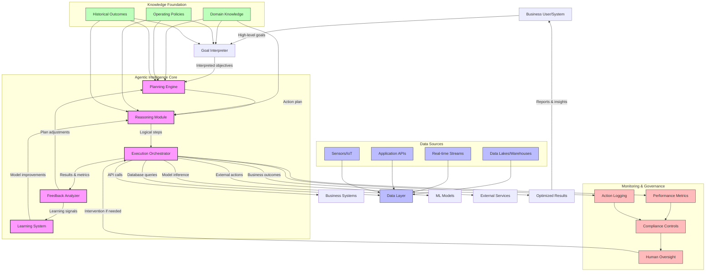
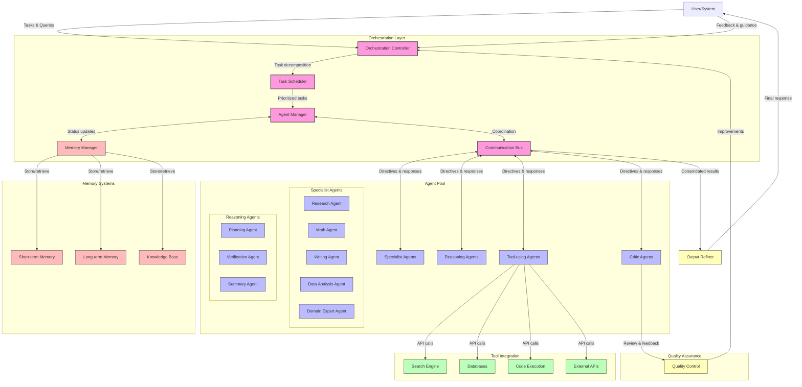
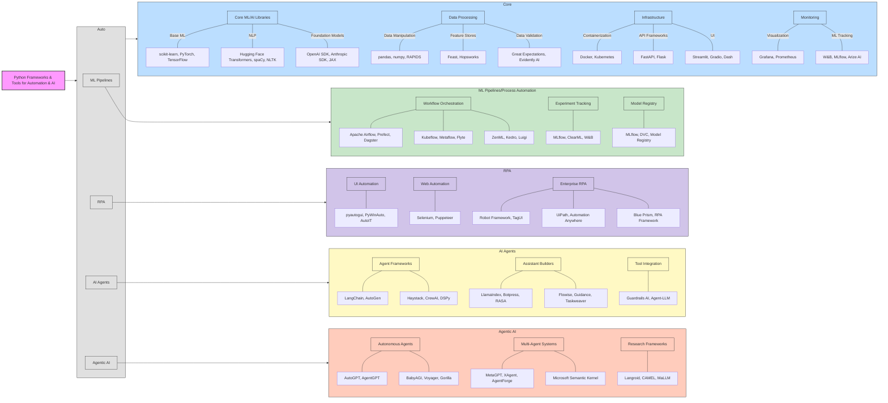

# Tech IQ #6: Automation to Agentic AI - A Leader’s Guide to Strategic Intelligence  
*From Scripted Tasks to Self-Directed Systems: What Every CXO Needs to Know*  

---

## Executive Summary  
Automation and AI are not interchangeable. **Automation** follows rules; **AI** makes decisions. This guide breaks down four critical tiers of intelligent systems—ML workflows, RPA, AI Agents, and Agentic AI—and how they transform operations, reduce costs, and unlock innovation.  

---

## The Four Tiers of Intelligent Systems  

### 1. **ML Workflows: The Recipe Followers**  
- **What it is**: Codified, repeatable processes for data and models.  
- **Key Traits**:  
  - ✅ Fixed steps (data → model → predictions)  
  - ✅ Scheduled execution (nightly reports, batch scoring)  
  - ❌ No adaptability; breaks if inputs change  
- **Ideal For**:  
  - Credit scoring  
  - Inventory forecasting  
  - Compliance reporting  

---

### 2. **RPA: The Digital Clerk**  
- **What it is**: Software "robots" mimicking human UI interactions.  
- **Key Traits**:  
  - ✅ Copies/pastes data between legacy systems  
  - ✅ Zero coding needed (drag-and-drop tools)  
  - ❌ Fragile (fails if button moves)  
- **Ideal For**:  
  - Invoice processing  
  - HR onboarding workflows  
  - Data migration  

---

### 3. **AI Agents: The Task Orchestrators**  
- **What it is**: LLM-powered assistants executing predefined workflows.  
- **Key Traits**:  
  - ✅ Chains API calls + AI (e.g., "Fetch data → summarize → email")  
  - ✅ Handles simple decision trees  
  - ❌ Limited autonomy  
- **Ideal For**:  
  - Customer service chatbots  
  - Report generation  
  - Document processing  

---

### 4. **Agentic AI: The Strategic Partner**  
- **What it is**: Goal-driven systems that plan, act, and learn autonomously.  
- **Key Traits**:  
  - ✅ Sets own sub-goals (e.g., "Reduce energy costs → optimize grid → negotiate contracts")  
  - ✅ Learns from failures (adaptive retraining)  
  - ❌ High complexity; requires guardrails  
- **Ideal For**:  
  - Real-time fraud detection  
  - Supply chain optimization  
  - Personalized healthcare  

**Evolution of Automation**

```mermaid
flowchart TD
    
    %% Flow Structure - Four columns for comparison
    subgraph "ML Process Automation"
        PA1[Scheduled Trigger]-->|Fixed Interval|PA2[Data Pipeline]
        PA2-->|Predetermined Steps|PA3[Model Training]
        PA3-->|Fixed Algorithm|PA4[Output Generation]
        PA4-->|Predefined Format|PA5[Report Delivery]
        
        PA99[CHARACTERISTICS:]-->|Deterministic|PA100[Repeatable Steps]
        PA100-->|No Adaptation|PA101[Fixed Outputs]
    end
    
    subgraph "RPA"
        RPA1[UI Trigger]-->|Script Activation|RPA2[UI Navigation]
        RPA2-->|Fixed Path|RPA3[Data Entry/Extraction]
        RPA3-->|Predefined Actions|RPA4[Process Execution]
        RPA4-->|If/Then Logic|RPA5[Task Completion]
        
        RPA99[CHARACTERISTICS:]-->|UI-Driven|RPA100[Click & Type Operations]
        RPA100-->|Simple Branching|RPA101[Fixed Workflow]
    end
    
    subgraph "AI Agents"
        AA1[User Command]-->|Prompt Processing|AA2[Task Interpretation]
        AA2-->|Task-Specific Logic|AA3[Tool Selection]
        AA3-->|Predefined Methods|AA4[API Calls & LLM Use]
        AA4-->|Response Generation|AA5[Output Delivery]
        
        AA99[CHARACTERISTICS:]-->|Prompt-Driven|AA100[Fixed Capability Set]
        AA100-->|Limited Adaptation|AA101[Specialized Tasks]
    end
    
    subgraph "Agentic AI"
        AG1[Goal Definition]-->|Objective Analysis|AG2[Strategy Planning]
        AG2-->|Autonomous Reasoning|AG3[Dynamic Tool Selection]
        AG3-->|Self-Directed Execution|AG4[Outcome Evaluation]
        AG4-->|Feedback Analysis|AG5[Strategy Refinement]
        AG5-->|Continuous Learning|AG2
        
        AG99[CHARACTERISTICS:]-->|Self-Directed|AG100[Adaptive Planning]
        AG100-->|Outcome-Focused|AG101[Autonomous Decisions]
    end
    
    %% Style
    classDef process fill:#d1c4e9,stroke:#333
    classDef rpa fill:#bbdefb,stroke:#333
    classDef ai_agent fill:#c8e6c9,stroke:#333
    classDef agentic fill:#ffecb3,stroke:#333
    classDef char fill:#f5f5f5,stroke:#333,stroke-dasharray: 5 5
    
    class PA1,PA2,PA3,PA4,PA5 process
    class RPA1,RPA2,RPA3,RPA4,RPA5 rpa
    class AA1,AA2,AA3,AA4,AA5 ai_agent
    class AG1,AG2,AG3,AG4,AG5 agentic
    class PA99,PA100,PA101,RPA99,RPA100,RPA101,AA99,AA100,AA101,AG99,AG100,AG101 char
```

---

## Tier Comparison: Capabilities & Impact  
| **Aspect**       | ML Workflows | RPA       | AI Agents     | Agentic AI      |  
|-------------------|--------------|-----------|---------------|-----------------|  
| **Autonomy**      | None         | None      | Low           | High            |  
| **Adaptability**  | ❌           | ❌        | Limited       | ✅ Self-optimizing |  
| **ROI Focus**     | Cost savings | Cost savings | Efficiency   | Revenue growth  |  
| **Implementation**| 2-4 months   | 1-3 months| 3-6 months    | 6-12+ months    |  
| **Risk**          | Low          | Medium    | Medium        | High (ethics, compliance) |  

---

## Industry Applications: Where to Start  
| **Industry**      | Quick Win (ML/RPA)              | Strategic Play (Agentic AI)          |  
|--------------------|----------------------------------|---------------------------------------|  
| **Banking**        | Automated loan approvals         | Dynamic portfolio optimization        |  
| **Healthcare**     | Patient data entry automation    | Proactive treatment plans             |  
| **Retail**         | Demand forecasting               | Autonomous inventory allocation       |  
| **Manufacturing**  | QC report generation             | Self-optimizing production lines      |  
| **Energy**         | Emissions reporting              | Real-time grid balancing              |  

---

## Architecture Blueprint  
1. **Data Layer**: Lakes, warehouses, IoT streams  
2. **Orchestration**:  
   - *ML Workflows*: Airflow, Kubeflow  
   - *RPA*: UiPath, Automation Anywhere  
   - *AI Agents*: LangChain, Microsoft Semantic Kernel  
   - *Agentic AI*: Custom LLM orchestrators  
3. **Execution**: APIs, robotic UIs, IoT actuators  
4. **Guardrails**: Compliance checks, ethics review boards  

**Sample Agentic AI Architecture Process Flow Diagram**

**Sample Multi-Agent System Architecture Process Flow Diagram**

---

## Strategic Playbook for Leaders  

### Phase 1: Foundation (0-6 Months)  
1. Automate manual reports with **ML workflows** (ROI: 20-40% cost reduction).  
2. Deploy **RPA** to eliminate 10+ FTEs in back-office tasks.  

### Phase 2: Scaling (6-18 Months)  
3. Build **AI Agents** for customer-facing processes (chatbots, email triage).  
4. Implement drift monitoring for critical models.  

### Phase 3: Transformation (18-36 Months)  
5. Pilot **Agentic AI** in one high-impact area (e.g., fraud detection).  
6. Establish AI ethics governance framework.  

---

## Tools & Frameworks  
| **Tier**         | Open Source          | Enterprise             |  
|-------------------|----------------------|------------------------|  
| **ML Workflows**  | MLflow, Apache Airflow | SageMaker Pipelines   |  
| **RPA**           | Robot Framework      | UiPath, Blue Prism     |  
| **AI Agents**     | LangChain, AutoGen   | AWS Bedrock, Azure AI, Vertex AI  |  
| **Agentic AI**    | AutoGPT, BabyAGI, ADK     | Custom solutions       |  

---

## Risks & Mitigations  
1. **Hallucinating Agents**: Implement "circuit breakers" to halt nonsensical actions.  
2. **Data Poisoning**: Audit training data sources monthly.  
3. **Compliance**: Store all model versions + decision logs for 7+ years.  
4. **Ethics**: Form cross-functional AI review boards.  

---
## The Bottom Line  
**Automation** cuts costs. **AI Agents** boost efficiency. But **Agentic AI** redefines industries. The question isn’t *if* you’ll adopt these systems—it’s *how fast* you’ll move from tactical scripts to strategic intelligence.  

👉 **Next Step**: Audit your workflows. Identify one process to upgrade from RPA to AI Agents this quarter.  

---

# Banking Use Cases:

| **Use Case**                  | **Agentic AI (Goal)**                                                                                          | **AI Agent (Task)**                                                                                   | **ML Pipeline Automation** (Pipeline Focus)                                            | **RPA** (UI Automation Focus)                                                                   |
|-------------------------------|----------------------------------------------------------------------------------------------------------------|-------------------------------------------------------------------------------------------------------|---------------------------------------------------------------------------------------------|-----------------------------------------------------------------------------------------------------|
| **Credit Underwriting**       | “Minimize default risk while optimizing approval rates.”                                                       | Fetch customer credit & income data → run scoring model → generate decision recommendation            | Scheduled pipeline: ingest customer data → train/retrain model → score new applicants        | Automate login to credit bureau portal → copy scores → paste into loan management system            |
| **Fraud Detection & Response**| “Continuously reduce fraud losses and false positives.”                                                         | Pull transaction logs → apply detection rules → generate fraud alerts                                 | Nightly batch: train/score anomaly detection model → update alert dashboard                   | Extract alert list → enter cases into investigation tool → email alerts                              |
| **AML Transaction Monitoring** | “Maintain AML compliance with minimal false alerts.”                                                           | Scan transactions → flag suspicious patterns → draft SAR for review                                    | Pipeline: preprocess transactions → run AML models → feed flagged cases to dashboard           | Download suspicious list → populate SAR forms → submit to compliance system                         |
| **Portfolio Risk Management** | “Keep portfolio drawdown below 5% in real time.”                                                               | Compute VaR & stress metrics → generate weekly stress report                                          | Automated job: calculate risk metrics nightly → refresh risk dashboards                        | Grab dashboard snapshot → email to risk committee                                                  |
| **Customer Onboarding**       | “Optimize onboarding conversion while ensuring compliance.”                                                   | Retrieve KYC documents → validate fields → escalate exceptions                                        | OCR/ML pipeline: extract data → verify identity → score onboarding risk                         | Download docs from email → upload to KYC portal → flag missing fields                                |
| **Personalized Cross-Sell**   | “Maximize incremental revenue via tailored offers.”                                                            | Segment customers → apply campaign templates → schedule and send outreach                             | Propensity pipeline: score customers → generate content snippets → feed CRM                    | Export segment list → import into marketing tool → launch email blasts                              |
| **Payment Exception Handling**| “Maintain exception rate < 0.5% and resolve all within SLA.”                                                   | Fetch exception logs → normalize data → email exception report                                        | Exception pipeline: classify & prioritize exceptions → update ticketing system                 | Log into payment system → export exceptions → forward to operations inbox                           |
| **Treasury Cash Forecasting** | “Ensure liquidity needs met at minimal cost, autonomously.”                                                    | Aggregate cash-flow data → run forecasting model → populate forecast dashboard                        | Forecasting pipeline: ingest cash flows → train forecast model → deploy predictions             | Extract forecast output → update spreadsheets → distribute to treasury team                        |
| **Daily Report Distribution** | *Not applicable*                                                                                               | Generate and email daily performance reports                                                          | Scheduled job: compile data → render report template → save to repository                      | Open report files → attach to email → send to distribution list                                     |

# Manufacturing Use Cases:

| **Use Case**                     | **Agentic AI (Goal)**                                                                                                             | **AI Agent (Task)**                                                                                                               | **ML Pipeline Automation** (Pipeline Focus)                                                                 | **RPA** (UI Automation Focus)                                                           |
|----------------------------------|-----------------------------------------------------------------------------------------------------------------------------------|-----------------------------------------------------------------------------------------------------------------------------------|-----------------------------------------------------------------------------------------------------------------|---------------------------------------------------------------------------------------------|
| **Predictive Maintenance**       | “Maintain equipment uptime > 99% by autonomously scheduling maintenance, ordering parts, and optimizing crew dispatch.” – Ingest real-time sensor streams – Diagnose failures early – Plan & dispatch maintenance – Learn optimal schedules | Fetch latest sensor logs → run anomaly detection → compile exception report → email maintenance team                              | Ingest historical & live sensor feeds → retrain anomaly model weekly → score assets → update maintenance dashboard | Log into CMMS → download sensor export → copy anomalies → paste into work-order system     |
| **Quality Inspection**           | “Keep defect rate < 0.1%.” – Continuously analyze vision feeds – Detect process drift – Adjust machine parameters – Learn effective fixes                         | Pull QC images → classify pass/fail → generate PDF summary → distribute to QA leads                                              | Image-processing pipeline: collect labeled images → train defect classifier → deploy & score new images          | Navigate to inspection tool → export defect list → upload into ERP                          |
| **Supply Chain Risk Monitoring** | “Limit disruption lead-time < 2 days.” – Monitor supplier KPIs & external signals (weather, news) – Re-route orders proactively – Negotiate alternates – Learn reliability profiles  | Compile weekly supplier dashboard → highlight high-risk vendors → notify procurement team                                        | Ingest delivery times & incident logs → train delay-prediction model → output risk scores                        | Log into supplier portal → export delivery logs → update risk spreadsheet                    |
| **Production Scheduling**        | “Maximize throughput within energy & labor constraints.” – Ingest orders, machine status & shift data – Dynamically plan schedules – Trigger shift alerts          | Generate daily production schedule in Excel → assign orders to lines → email schedule to operations                              | Demand & capacity pipeline: forecast load → optimize schedule offline → publish to MES                            | Open scheduling UI → import Excel → click through allocation screens                          |
| **Inventory Replenishment**      | “Maintain optimal stock levels to avoid stockouts & overstock.” – Monitor real-time consumption & lead times – Auto-adjust orders – Learn seasonality               | Fetch inventory & reorder rules → generate PO list → send to suppliers                                                           | Demand-forecast pipeline: ingest sales & usage → forecast demand → generate reorder recommendations               | Log into ERP → download stock report → enter PO details → submit                             |
| **Demand Forecasting**           | “Minimize forecasting error for next quarter.” – Ingest sales, market & macro data – Blend models & expert inputs – Adjust plans autonomously                       | Pull sales history → run baseline forecast → fill report template → email planning team                                       | Forecast pipeline: retrain models monthly → publish updated forecasts to BI dashboards                             | Navigate BI tool → export forecast CSV → email stakeholders                                   |
| **Energy Usage Optimization**    | “Reduce kWh per unit by 5%.” – Monitor live energy meters & machine loads – Sequence high-usage tasks off-peak – Adjust setpoints via SCADA API – Learn efficiencies | Fetch today’s energy usage → calculate KPIs → generate PDF report → send to facilities managers                                 | Energy-model pipeline: ingest historical usage → train regression model → flag over-use alarms                     | Open SCADA web UI → export meter readings → update Excel → email report                       |
| **Compliance Reporting**         | “Ensure 100% on-time regulatory compliance.” – Ingest audit logs & sensor data continuously – Detect gaps vs. standards – Trigger corrective workflows – Maintain audit trail | Gather audit findings → fill compliance report template → submit to regulators                                                   | Compliance pipeline: parse logs → apply rule checks → output flagged items to dashboard                             | Download system logs → populate compliance software fields → submit report                   |

# Healthcare Use Cases:

| **Use Case**                         | **Agentic AI (Goal)**                                                                                 | **AI Agent (Task)**                                                              | **ML Pipeline Automation** (Pipeline Focus)                              | **RPA** (UI Automation Focus)                                                 |
|--------------------------------------|-------------------------------------------------------------------------------------------------------|-----------------------------------------------------------------------------------|--------------------------------------------------------------------------------|------------------------------------------------------------------------------------|
| **Predictive Patient Deterioration** | “Maintain patient stability by preventing critical events.” – Ingest real‐time vitals – Diagnose risks – Adjust care plans – Learn best interventions | Fetch latest vitals → run deterioration model → compile risk report → alert care team | Ingest EHR & sensor streams → retrain anomaly model daily → score patients → update dashboard | Log into monitoring system → export vitals → paste into analytics tool → email PDF  |
| **Medical Imaging Diagnostics**      | “Ensure diagnostic accuracy ≥ 99% while maximizing throughput.” – Analyze scans continuously – Identify anomalies – Recommend follow-up – Refine thresholds        | Pull new scan images → run anomaly detection → generate report → send to radiologists   | Image pipeline: ingest DICOMs → retrain CNN weekly → deploy & score images     | Download DICOMs → open in PACS viewer → run built-in analysis → save results         |
| **Appointment Scheduling Optimization** | “Maximize clinic utilization & minimize wait times.” – Ingest demand & staff data – Plan & re-plan schedules – Send reminders automatically                     | Generate daily schedule → assign slots → send confirmations                       | Forecast & allocation pipeline: ingest demand → optimize slots → publish      | Open scheduling UI → import appointments → send email reminders                     |
| **Claims Processing & Fraud Detection**| “Minimize fraudulent payouts & processing time.” – Monitor claims – Investigate anomalies – Auto-settle low‐risk cases – Learn from outcomes                  | Fetch new claims → apply fraud model → flag suspicious → compile report → notify team | Ingest claims data → retrain fraud model nightly → score new claims           | Download claim docs → input into claims portal → generate claim IDs → update sheet   |
| **Personalized Treatment Planning**  | “Optimize patient outcomes across comorbidities.” – Ingest full profile – Reason on guidelines – Propose regimens – Refine from feedback                       | Pull patient record → match protocols → generate treatment plan → send to physician  | Ingest EHR + outcomes → train outcome models → score treatment options         | Extract patient data → fill planner tool → export PDF → email to care team           |
| **Inventory & Supply Management**    | “Maintain optimal stock to prevent shortages & waste.” – Monitor usage & lead times – Auto-order supplies – Learn seasonality                                  | Fetch stock & rules → generate PO list → send to suppliers                          | Demand‐forecast pipeline: ingest usage → train forecasts → recommend orders    | Log into ERP → export stock levels → enter PO → submit                             |
| **Clinical Trial Data Monitoring**   | “Ensure trial integrity & patient safety continuously.” – Ingest trial data – Detect protocol deviations – Trigger corrective actions – Learn risk predictors   | Aggregate trial entries → run anomaly checks → generate exceptions report → notify board | Trial data pipeline: preprocess entries → retrain anomaly model weekly → score new data | Download trial logs → upload to monitoring tool → generate notifications           |
| **Regulatory Compliance Reporting**   | “Achieve 100% on-time compliance with evolving regulations.” – Ingest audit & sensor logs – Detect gaps vs. standards – Trigger workflows – Maintain audit trail | Gather compliance data → fill report template → submit to regulators                | Compliance pipeline: parse logs → apply rule checks → output flagged items     | Extract logs → populate regulator portal → submit reports → archive confirmations   |

# Retail/FMCG Use Cases:

| **Use Case**                        | **Agentic AI (Goal)**                                                                                   | **AI Agent (Task)**                                                      | **ML Pipeline Automation** (Pipeline Focus)                                   | **RPA** (UI Automation Focus)                                                    |
|-------------------------------------|---------------------------------------------------------------------------------------------------------|---------------------------------------------------------------------------|-------------------------------------------------------------------------------------|--------------------------------------------------------------------------------------|
| **Demand Forecasting**              | “Minimize forecast error to balance supply & demand.” – Ingest sales, promotions, weather data – Blend models – Auto-update plans – Learn seasonality    | Fetch historic sales → run forecast model → generate report → email team    | Ingest sales & external data → retrain model weekly → score next period → update BI | Login ERP → export sales report → paste into Excel → email forecast                    |
| **Inventory Replenishment**         | “Maintain optimal stock to avoid stockouts & overstock.” – Monitor real-time usage – Predict stockouts – Auto-order replenishment – Learn supplier reliability | Fetch stock & reorder rules → generate PO list → send to suppliers          | Demand pipeline: ingest sales & usage → forecast demand → create reorder list      | Log into procurement portal → download inventory report → upload PO details            |
| **Dynamic Pricing Optimization**    | “Maximize margin under demand & inventory constraints.” – Ingest pricing & competitor data – Reason price changes – Implement updates – Learn elasticity | Scrape competitor prices → calculate recommendations → compile report → email | Retrain elasticity models monthly → score SKUs → output price suggestions           | Scrape prices via UI → enter new prices → verify on pricing tool                       |
| **Promotion Effectiveness**         | “Maximize ROI of promotions across channels.” – Ingest promo & sales data – Reason best channels/timings – Propose budgets – Learn from performance      | Pull promo & sales logs → run uplift analysis → generate deck → email leads | Ingest promo & transaction data → train uplift models → score scenarios            | Download promo report → fill PPT template → distribute                               |
| **Supply Chain Risk Monitoring**    | “Limit disruption lead-time < 1%.” – Monitor supplier KPIs & external signals – Plan reroutes – Negotiate alternates – Learn risk profiles                 | Compile supplier performance → highlight high-risk → notify SCM team        | Ingest delivery & incident logs → retrain risk model → score suppliers             | Log into supplier portals → download logs → update risk spreadsheet                    |
| **Quality Control Inspection**      | “Keep defect rate under 0.01%.” – Analyze vision‐feeds continuously – Diagnose drift – Adjust parameters – Learn effective fixes                          | Fetch QC images → classify defects → compile PDF report → email QA team     | Vision pipeline: ingest labeled images → retrain classifier weekly → deploy model | Download images → upload to QC tool → capture results → file reports                  |
| **Production Scheduling**           | “Maximize throughput within capacity & labor limits.” – Ingest orders & shift data – Plan & re-plan schedules – Alert on disruptions – Learn patterns         | Generate next-day schedule → assign lines → email schedule                 | Scheduling pipeline: ingest order & capacity → optimize schedules → publish        | Open MES UI → input schedule → confirm allocations → send confirmation               |
| **Customer Sentiment Analysis**     | “Proactively improve brand sentiment.” – Ingest social & survey feedback – Detect emerging issues – Propose responses – Learn messaging effectiveness       | Fetch sentiment data → run analysis → compile report → email care team      | Text pipeline: ingest feedback → retrain sentiment model → score new feedback       | Login listening tool → export data → import into CRM → send alerts                   |

# Supply Chain Use Cases:

| **Use Case**                                | **Agentic AI (Goal)**                                                                                                                                          | **AI Agent (Task)**                                                                                                   | **ML Pipeline Automation** (Pipeline Focus)                                                                 | **RPA** (UI Automation Focus)                                                                                   |
|---------------------------------------------|----------------------------------------------------------------------------------------------------------------------------------------------------------------|-----------------------------------------------------------------------------------------------------------------------|-----------------------------------------------------------------------------------------------------------------|---------------------------------------------------------------------------------------------------------------------|
| **Dynamic Route Optimization**              | “Minimize total delivery time & fuel cost across fleet.” – Ingest real-time traffic, weather, order data – Plan & re-plan routes dynamically – Dispatch & learn best paths | Fetch today’s stops → run static route algorithm → generate route sheets → email dispatchers                         | Ingest GPS & traffic streams → retrain ETA models weekly → generate nightly optimized routes → push to TMS       | Log into TMS UI → import route file → export driver manifests → distribute via email                               |
| **Real-Time Freight Tracking & Exception Mgmt** | “Maintain on-time delivery ≥ 98% & resolve all exceptions within SLA.” – Monitor telematics & status feeds – Diagnose delays & root causes – Trigger corrective actions | Pull live shipment statuses → identify delays → compile exception report → notify operations team                   | Ingest telematics & sensor data → train anomaly-detection pipeline nightly → score active shipments → update dashboard | Export exception list → import into ticketing system → send alerts via email/SMS                                    |
| **Warehouse Space Utilization Optimization**| “Maximize warehouse space utilization & throughput.” – Monitor inventory flows & slotting patterns – Diagnose bottlenecks – Reconfigure layouts & learn best practices | Fetch current layout & inventory levels → generate slotting plan → send to warehouse managers                      | Ingest WMS & RFID logs → retrain space-optimization model weekly → output slotting recommendations                 | Log into WMS UI → apply layout changes manually → confirm updates                                                   |
| **Demand Forecasting & Inventory Allocation**| “Balance stock to minimize stockouts & holding costs.” – Ingest sales, lead-times & seasonality signals – Plan allocations across DCs – Adapt to shifts | Pull sales & inventory data → run forecast → generate allocation plan → email to supply planners                    | Ingest historical sales & external drivers → retrain forecasting pipeline monthly → output DC-level recommendations | Extract forecast CSV → upload to ERP → confirm allocation entries                                                   |
| **Supplier Risk Monitoring & Contingency**  | “Ensure supply continuity with disruption risk < 1%.” – Monitor supplier KPIs & external risk signals – Plan alternate sourcing – Learn reliability profiles | Compile supplier performance report → highlight high-risk vendors → suggest alternates → notify procurement team    | Ingest delivery metrics & news streams → retrain risk-prediction pipeline nightly → score suppliers → update dashboard | Log into supplier portal → download performance data → update risk spreadsheets → email to sourcing managers         |
| **Order Picking Optimization**              | “Minimize pick time & errors per order.” – Analyze order patterns & picker performance – Plan dynamic pick routes – Dispatch & refine routes           | Fetch today’s pick orders → run sequence optimization → generate pick lists → send to handheld devices              | Ingest order & picker log data → retrain pick-route model daily → push optimized sequences to WMS                | Extract pick lists → upload into scanner software → print pick tickets                                              |
| **Customs Compliance Processing**           | “Achieve 100% customs compliance & minimize clearance time.” – Monitor shipment docs & regulations – Detect & auto-fix form errors – Escalate complex cases | Pull shipment documents → validate fields → compile compliance report → email to trade-compliance team             | OCR pipeline: extract data from bills of lading → validate against rules nightly → flag exceptions → feed to dashboard | Download documents → populate customs portal fields → submit forms → archive confirmations                            |
| **Fleet Maintenance Planning**              | “Maintain fleet uptime ≥ 95% & minimize maintenance cost.” – Ingest telematics & usage data – Predict failures – Schedule & dispatch maintenance – Auto-order parts | Fetch vehicle usage & fault codes → run failure-prediction model → generate work orders → email to workshop        | Ingest sensor & service logs → retrain predictive-maintenance pipeline weekly → score fleet → update maintenance schedule | Log into CMMS UI → create maintenance orders → notify technicians via email                                         |

# IT Services Use Cases:

| **Use Case**                             | **Agentic AI (Goal)**                                                                                                                                           | **AI Agent (Task)**                                                                                              | **ML Pipeline Automation** (Pipeline Focus)                                                      | **RPA** (UI Automation Focus)                                                                                   |
|------------------------------------------|-----------------------------------------------------------------------------------------------------------------------------------------------------------------|------------------------------------------------------------------------------------------------------------------|--------------------------------------------------------------------------------------------------------|---------------------------------------------------------------------------------------------------------------------|
| **Incident Management & Resolution**     | “Maintain system uptime ≥ 99.9% by auto-resolving incidents.” – Ingest real-time alerts & logs – Diagnose root causes via LLM reasoning – Trigger remediation scripts – Learn resolution efficacy | Fetch incident logs → classify & prioritize → generate incident report → assign to on-call                       | Log ingestion pipeline: collect logs → train anomaly-detection model → score new alerts → update dashboard | Log into monitoring tool → export incident CSV → create tickets in ITSM system                                     |
| **DevOps CI/CD Pipeline Optimization**   | “Minimize build failures & deploy time.” – Monitor pipeline metrics continuously – Diagnose bottlenecks (tests, code quality) – Adjust parallelism & retries – Learn optimal configs | Fetch build logs → run failure classification → generate summary → notify Dev team                               | CI/CD pipeline: collect metrics → train predictive failure model → deploy to pipeline orchestrator      | Open CI dashboard → download failure reports → send email alerts                                                   |
| **Security Monitoring & Threat Response**| “Contain threats within 5 minutes of detection.” – Ingest security logs & threat intel – Reason attack patterns via LLM – Trigger firewall rules – Learn to refine detection rules | Pull SIEM alerts → apply rule filters → compile alert digest → email SOC                                         | Security pipeline: preprocess logs → train threat-detection model → score events → feed to SIEM         | Download alert logs → import into ticketing tool → escalate via email                                               |
| **IT Asset Lifecycle Management**        | “Optimize asset utilization & reduce risk.” – Track assets in real time – Diagnose under-utilization or EOL risks – Recommend reallocation/decommission – Learn usage patterns | Fetch inventory data → match against lifecycle policies → generate action list → notify asset manager            | Asset pipeline: ingest CMDB + usage metrics → train utilization model → output recommendations          | Log into CMDB → export asset list → apply updates → email stakeholders                                             |
| **Automated Software Testing & QA**      | “Ensure code quality ≥ 95% coverage & defect rate < 1%.” – Continuously evaluate new commits – Reason test gaps via LLM – Generate or augment test cases – Learn effective strategies | Trigger test suite → collect results → generate test report → send to QA                                         | Test pipeline: collect coverage data → retrain test-priority model → prioritize execution → update dashboards | Open test management tool → export results → upload to defect tracker                                              |
| **Helpdesk Ticket Triage & Resolution**  | “Resolve 80% of tickets within SLA autonomously.” – Ingest incoming tickets & context – Reason solutions via LLM – Apply fixes or recommend to agents – Learn from cases | Pull new tickets → classify & prioritize → route to support group → send acknowledgement                         | Ticket pipeline: preprocess text → train triage model → score tickets → update ITSM dashboards           | Download ticket exports → update statuses in ITSM UI → send notifications                                          |
| **Cloud Cost Optimization**              | “Reduce cloud spend by 15% without performance loss.” – Ingest usage & billing data – Diagnose waste (idle, over-provisioning) – Adjust instance types & schedules – Learn cost-performance trade-offs | Fetch billing data → run cost analysis → generate savings report → email FinOps team                             | Cost pipeline: ingest billing & metrics → train anomaly-detection model → score under-utilized resources | Log into cloud console → download cost report → apply tags via UI → email confirmations                             |
| **Capacity Planning & Allocation**       | “Maintain resource availability ≥ 95% while minimizing idle capacity.” – Monitor usage & forecast demand – Reason allocation via LLM – Reconfigure infra automatically – Learn demand patterns | Fetch usage metrics → run capacity model → prepare allocation plan → send to infra team                          | Planning pipeline: ingest metrics → retrain forecasting model → output capacity recommendations          | Export usage CSV → upload to capacity planning tool → schedule resource changes via UI                             |

# Telecom Use Cases:

| **Use Case**                               | **Agentic AI (Goal)**                                                                                                                                   | **AI Agent (Task)**                                                                                     | **ML Pipeline Automation** (Pipeline Focus)                                                | **RPA** (UI Automation Focus)                                                                      |
|--------------------------------------------|---------------------------------------------------------------------------------------------------------------------------------------------------------|---------------------------------------------------------------------------------------------------------|--------------------------------------------------------------------------------------------------|-------------------------------------------------------------------------------------------------------|
| **Network Fault Detection & Resolution**   | “Maintain network uptime ≥ 99.9% by autonomously detecting and resolving faults.” – Ingest real-time alarms & performance data – Diagnose root causes via reasoning – Reroute traffic or dispatch field crews – Learn failure patterns  | Fetch fault logs → correlate alarms → generate fault report → email NOC                                 | Ingest performance counters → retrain anomaly-detection model weekly → score new events → update dashboard  | Log into NMS → export alarm list → create tickets in ticketing system → notify teams                   |
| **Predictive Maintenance of Equipment**    | “Keep equipment availability ≥ 99.5% by predicting failures and scheduling maintenance.” – Monitor live sensor streams – Diagnose degradation early – Plan & dispatch maintenance – Auto-order parts and learn optimal schedules      | Fetch sensor logs → run failure-prediction model → compile maintenance list → email field teams          | Ingest sensor data → retrain predictive-maintenance pipeline weekly → score assets → update CMMS           | Download sensor report → open CMMS → create work orders → notify technicians via email                |
| **Churn Prediction & Retention**           | “Reduce monthly churn rate below target by autonomously identifying and engaging at-risk customers.” – Ingest usage, billing & sentiment data – Design & trigger tailored offers – Learn which interventions work best           | Pull churn scores → segment high-risk customers → populate retention email template → launch campaign   | Ingest CRM & usage logs → retrain churn-prediction pipeline weekly → score customers → sync segments to CRM  | Export high-risk list → import into marketing tool → schedule outreach                                |
| **Dynamic Resource Allocation**            | “Optimize bandwidth to maximize QoS and minimize cost in real time.” – Monitor traffic & QoS metrics – Plan & reconfigure allocations – Dispatch changes via APIs – Learn traffic patterns                           | Fetch utilization stats → calculate allocation plan → generate change request → email NOC               | Ingest traffic & QoS data → retrain allocation-optimization model nightly → publish recommended configs       | Log into OSS → apply config changes via UI → verify settings → update change log                      |
| **Service Provisioning Automation**        | “Provision new services within SLA 95% autonomously.” – Receive orders – Plan resource mapping – Orchestrate OSS/BSS API calls – Verify activation and troubleshoot – Learn to prevent failures                   | Retrieve new orders → run API sequence → generate status report → email support desk                    | Order-to-activation pipeline: preprocess orders → track activation times → retrain delay-model monthly         | Login CRM → copy order details → paste into provisioning portal → click through setup wizard → confirm |
| **Fraud & SIM-Cloning Detection**          | “Keep revenue loss from fraud < 0.1% by dynamically adapting detection and response.” – Ingest CDRs, location & device data – Detect evolving patterns – Disable suspect SIMs or alert – Learn attack vectors             | Pull daily CDR extract → apply fraud-detection rules → flag suspect accounts → email fraud team           | Ingest CDRs → retrain fraud-model nightly → score current calls → feed alerts into SOC dashboard             | Download CDR extract → upload into fraud portal → generate alert tickets                               |
| **Capacity Planning & Forecasting**        | “Match network capacity to demand with < 5% variance autonomously.” – Ingest historical & real-time usage – Forecast demand spikes – Provision resources via API – Learn seasonal patterns                          | Fetch usage history → run forecast → generate capacity plan → email planning team                        | Ingest usage & external drivers → retrain forecasting pipeline monthly → output recommendations to planning tool | Export usage report → import into capacity planning UI → distribute plan via email                     |
| **Customer Service Ticket Triage & Fixes** | “Resolve 60% of support tickets autonomously within SLA.” – Ingest tickets & context – Reason solutions via LLM – Execute fixes or escalate – Learn resolution patterns                                       | Pull new tickets → classify & prioritize → route to correct queue → send acknowledgements                | Ingest ticket logs → retrain triage model daily → score & tag tickets → update ITSM dashboards                | Download ticket CSV → fill forms in support portal → update statuses → email confirmations              |

# Energy Use Cases:

| **Use Case**                                 | **Agentic AI (Goal)**                                                                                                                                         | **AI Agent (Task)**                                                                                                                           | **ML Pipeline Automation** (Pipeline Focus)                                                    | **RPA** (UI Automation Focus)                                                                                  |
|----------------------------------------------|---------------------------------------------------------------------------------------------------------------------------------------------------------------|-------------------------------------------------------------------------------------------------------------------------------------------------|------------------------------------------------------------------------------------------------------|--------------------------------------------------------------------------------------------------------------------|
| **Predictive Maintenance of Turbines & Compressors** | “Maintain equipment uptime ≥ 98% by autonomously scheduling maintenance and optimizing crews.” – Ingest real-time sensor streams – Diagnose degradation early – Plan & adjust workflows – Learn optimal schedules | Fetch sensor data → run anomaly-detection model → compile exception report → email maintenance team                                             | Ingest historical & live sensor feeds → retrain anomaly model weekly → score assets → update dashboard            | Download sensor logs → copy anomalies → paste into CMMS → generate work orders                                      |
| **Pipeline Integrity & Leak Detection**      | “Ensure 100% leak-free operation by proactively detecting anomalies and triggering isolation or repair.” – Monitor SCADA & sensor data – Diagnose leaks via reasoning – Dispatch isolation protocols – Learn from incidents | Pull pressure/flow data → apply threshold checks → generate leak alert → email control-room operators                                          | Ingest SCADA & sensor logs → retrain leak-detection model monthly → score pipeline segments → update dashboard      | Export pressure reports → import into integrity tool → send PDF alerts                                              |
| **Demand Forecasting & Load Balancing**      | “Maintain grid stability by keeping supply-demand variance < 2% autonomously.” – Ingest load, weather & market signals – Plan & re-plan dispatch – Trigger ramps or demand-response – Learn demand patterns         | Fetch demand & supply data → run load-forecast model → generate dispatch schedule → email dispatch team                                       | Ingest historical load, weather & market data → retrain forecasting pipeline nightly → publish forecasts to SCADA   | Download forecast CSV → upload to dispatch system → notify operators                                                |
| **Renewable Generation Optimization**        | “Maximize renewable yield vs. constraints by continuously adjusting control parameters.” – Monitor turbine/solar metrics & forecasts – Reason optimal settings – Adjust blade/inverter parameters – Learn trade-offs      | Fetch weather & output data → run yield-prediction model → compile performance report → email asset manager                                    | Ingest sensor & weather feeds → retrain yield models weekly → score next-day output → update optimization dashboard  | Download weather & output report → paste into Excel → email recommendations                                         |
| **Drilling & Production Optimization**       | “Optimize well performance by maximizing ROP and minimizing non-productive time.” – Ingest drilling & geology data – Diagnose inefficiencies via reasoning – Plan bit changes & mud recipes – Learn best practices   | Pull drilling logs → apply KPI model → generate performance report → email drilling engineer                                                  | Ingest drilling logs & outcomes → retrain ROP-prediction pipeline weekly → output parameter recommendations          | Extract drilling logs → import into analysis tool → generate PDF → distribute                                         |
| **Compliance & Emissions Reporting**         | “Ensure regulatory compliance and minimize emissions violations autonomously.” – Ingest emissions & operational data – Detect exceedances – Trigger corrective workflows – Learn to minimize violations           | Gather emissions & operational logs → run compliance checks → fill report template → submit to regulators                                     | Ingest sensor & process data → apply compliance-rule pipeline → output flagged cases → feed to dashboard             | Download logs → populate regulator portal → submit reports → archive confirmations                                   |
| **Energy Trading & Market Optimization**     | “Maximize trading P&L within defined risk limits autonomously.” – Ingest market prices, demand forecasts & portfolio exposures – Plan & execute trades/hedges – Adapt strategies to volatility – Learn risk profiles | Fetch market & portfolio data → run risk/revenue model → generate trade recommendations → email trading desk                                    | Ingest market & portfolio streams → retrain forecasting & risk models nightly → output trading signals               | Export P&L reports → import into trading platform → schedule order placements                                        |
| **Spare Parts & Inventory Management**       | “Maintain optimal spare-parts availability with < 1% stockout autonomously.” – Monitor usage, lead-times & supplier performance – Place or adjust orders – Learn demand cycles                                 | Fetch inventory levels & reorder rules → generate PO list → send to suppliers                                                                  | Ingest usage & lead-time data → retrain demand-forecast pipeline weekly → generate reorder recommendations             | Log into ERP → download stock report → enter PO details → submit orders                                              |

---
👉 **Tech IQ Mission:** No jargon, just clarity. Simplifying tech for decisive leadership. Connect with me on [LinkedIn](https://www.linkedin.com/in/arockialiborious/) for real-talk AI insights.

