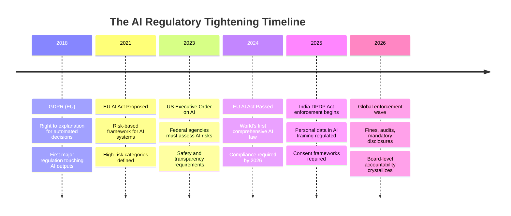
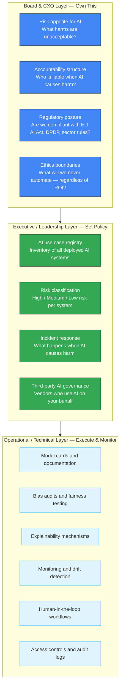
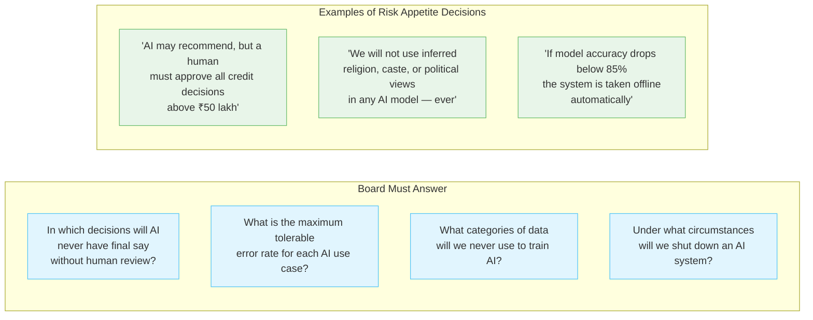
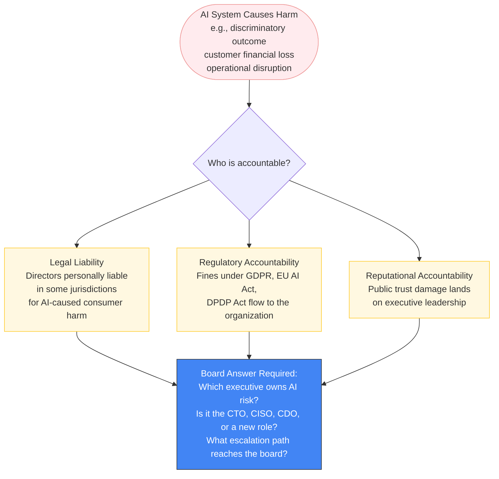
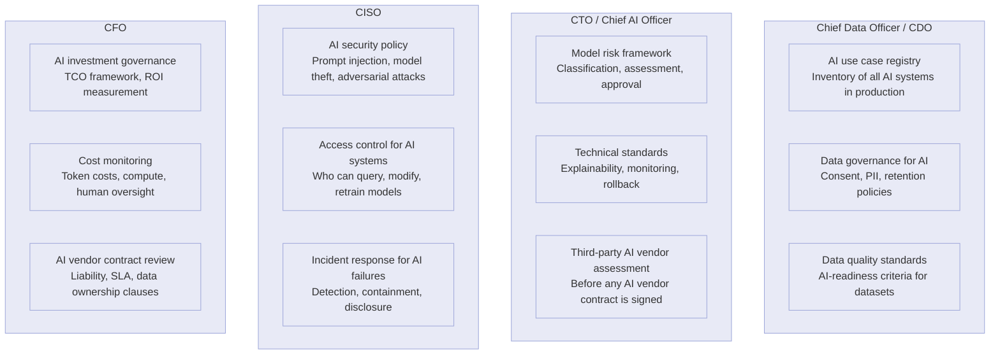
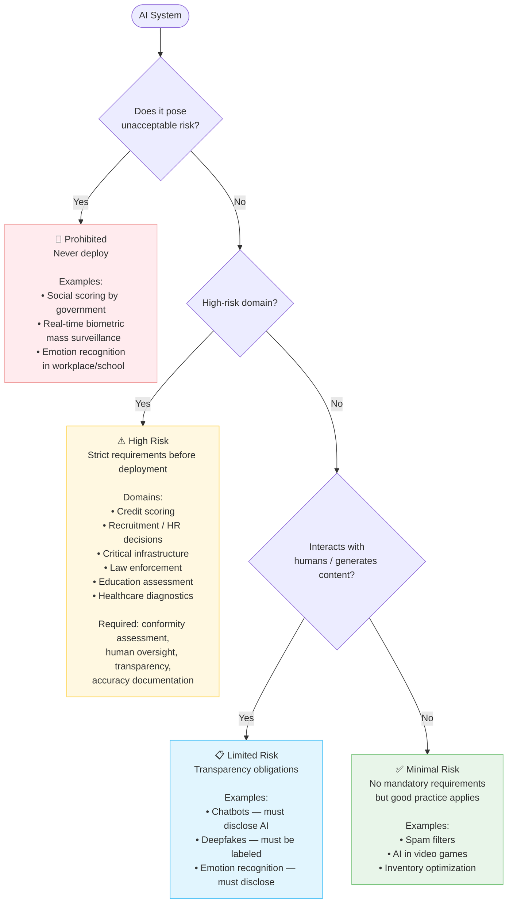
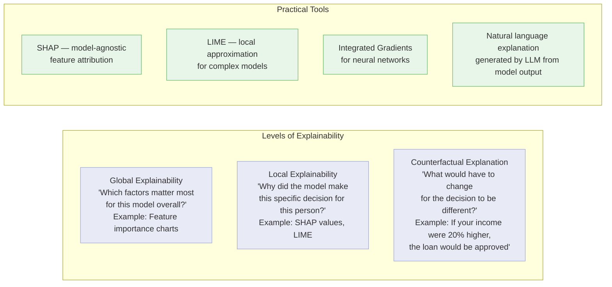
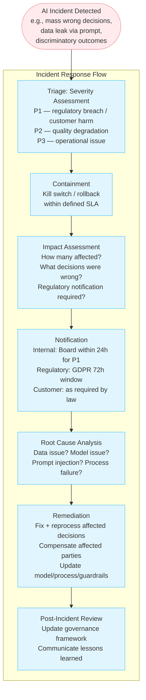

# Tech IQ #20: AI Governance — What the Board Should Own vs. Delegate
*Accountability Doesn't Disappear Because a Model Made the Decision*

When an AI system denies a loan, misdiagnoses a document, or makes a discriminatory recommendation — the board cannot say "the algorithm decided." Legal liability, regulatory exposure, and reputational risk land on human shoulders regardless of what made the call.

This edition gives boards and CXOs a clear framework for what to own, what to delegate, and what to never outsource.

---

## Why Governance Matters Now — Not Later

The window for "we'll figure out governance later" has closed. Boards that treat AI governance as an IT problem — not a fiduciary one — are accumulating undisclosed liability.

---

## The Governance Stack: Three Layers

---

## What the Board Should Own — Non-Delegatable

These four decisions cannot be safely delegated to the AI team, the CTO, or a vendor. They require board-level clarity because they define the ethical and legal boundaries within which all other AI decisions are made.

### 1. Risk Appetite Statement

### 2. Accountability Structure

### 3. Ethics Boundaries — The "Never Automate" List

Regardless of technical feasibility or ROI, some decisions should retain human judgment. The board should define this list explicitly.

| Category | Example Decision | Why AI Alone Is Insufficient |
|----------|-----------------|------------------------------|
| **Employment** | Terminate an employee | Legal process, context, human dignity |
| **Healthcare** | Deny a treatment or coverage | Medical complexity, patient rights |
| **Credit (high-value)** | Deny a large loan without explanation | Regulatory right to explanation |
| **Legal** | Determine guilt or liability | Due process requirements |
| **Safety-critical** | Override a safety interlock | Physical harm potential |
| **Grievance** | Reject a legal complaint | Procedural fairness |

---

## What to Delegate — With Oversight Structures

These decisions should be owned by named executives with clear reporting lines to the board.

---

## The AI Use Case Registry — The Foundation of Governance

You cannot govern what you have not inventoried. Every organization deploying AI needs a use case registry.

```mermaid
flowchart LR
    Registry[(AI Use Case Registry)] --> Fields

    subgraph Fields["Required Fields per Use Case"]
        F1[System name & description]
        F2[Business owner — named individual]
        F3[Data inputs — sources, sensitivity, consent status]
        F4[Decision type — recommendation vs. autonomous action]
        F5[Risk classification — High / Medium / Low]
        F6[Human oversight mechanism]
        F7[Evaluation method and frequency]
        F8[Regulatory applicability]
        F9[Last audit date]
        F10[Incident history]
    end

    subgraph Trigger["What Triggers Registration"]
        T1[Any new AI system approved for production]
        T2[Any AI capability added to existing product]
        T3[Any third-party AI service integrated]
        T4[Any AI used to make or influence decisions\naffecting customers or employees]
    end

    classDef registry fill:#4285F4,stroke:#333,color:white;
    classDef field fill:#e1f5fe,stroke:#4fc3f7;
    classDef trigger fill:#fff8e1,stroke:#ffca28;
    class Registry registry;
    class F1,F2,F3,F4,F5,F6,F7,F8,F9,F10 field;
    class T1,T2,T3,T4 trigger;
```

---

## Risk Classification — The EU AI Act Framework Simplified

The EU AI Act classifies AI systems by risk level. This is the practical framework boards should apply regardless of jurisdiction — because customers and regulators expect it.

---

## Explainability — A Practical Requirement, Not Just Ethics

For any AI system making decisions that affect people, the ability to explain the decision is both a legal right and a trust requirement.

**Board Question**: For every high-risk AI system, can we produce a written explanation for any individual decision within 24 hours? Under GDPR and the EU AI Act, this is a legal requirement for automated decisions affecting people.

---

## The AI Incident Response Plan

Every organization with AI in production needs a defined response plan for AI-caused incidents — before the incident happens.

---

## The Board AI Governance Checklist

| Governance Element | Status | Owner | Review Frequency |
|-------------------|--------|-------|-----------------|
| AI risk appetite statement documented | ⬜ | Board | Annual |
| Named executive accountable for AI risk | ⬜ | CEO | Permanent |
| AI use case registry maintained | ⬜ | CDO | Quarterly |
| All AI systems risk-classified | ⬜ | CTO / CDO | Per new deployment |
| High-risk systems: conformity assessment done | ⬜ | CTO | Per deployment |
| Explainability mechanism in place for customer-facing AI | ⬜ | CTO | Per deployment |
| AI incident response plan documented & tested | ⬜ | CISO | Annual drill |
| Third-party AI vendor contracts reviewed for liability | ⬜ | CFO / Legal | Per contract |
| Employee AI use policy published | ⬜ | CHRO | Annual |
| Board briefed on AI risk quarterly | ⬜ | CTO / CDO | Quarterly |

---

## Key Takeaways

1. **AI governance is a board responsibility, not a technical one.** The board sets the risk appetite. Everything else follows from that. If the board has not set it, no one else can.
2. **"The algorithm decided" is not a legal defense.** Directors carry personal liability in some jurisdictions for AI-caused consumer harm. Know this before the incident.
3. **The EU AI Act is not optional for global companies.** If your AI touches EU residents — as customers, employees, or partners — you are in scope. The enforcement wave is here.
4. **Inventory before governance.** You cannot classify, monitor, or govern AI systems you have not catalogued. A use case registry is the first governance deliverable.
5. **Explainability is a product requirement for high-risk AI.** Not because regulators demand it — because customers expect it and trust requires it.

---

Simplifying tech for decisive leadership. Connect with me on [LinkedIn](https://www.linkedin.com/in/arockialiborious/) for real-talk AI insights.
