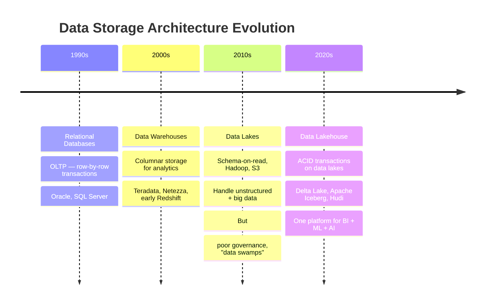
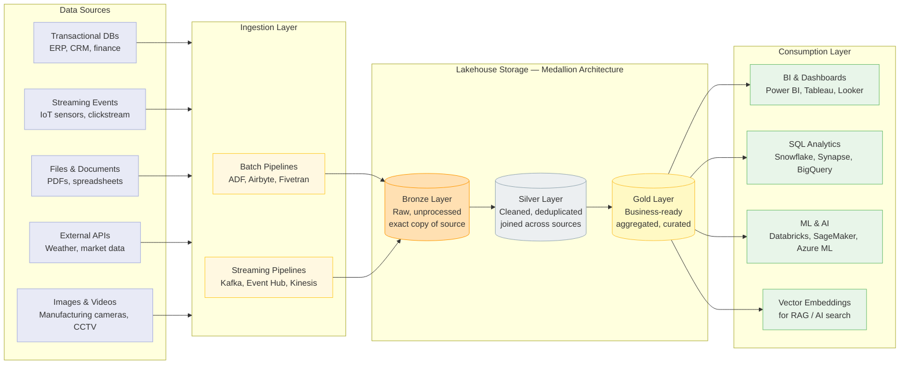
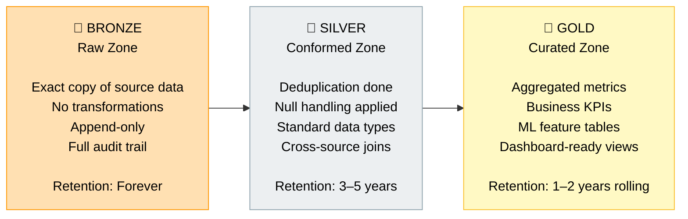
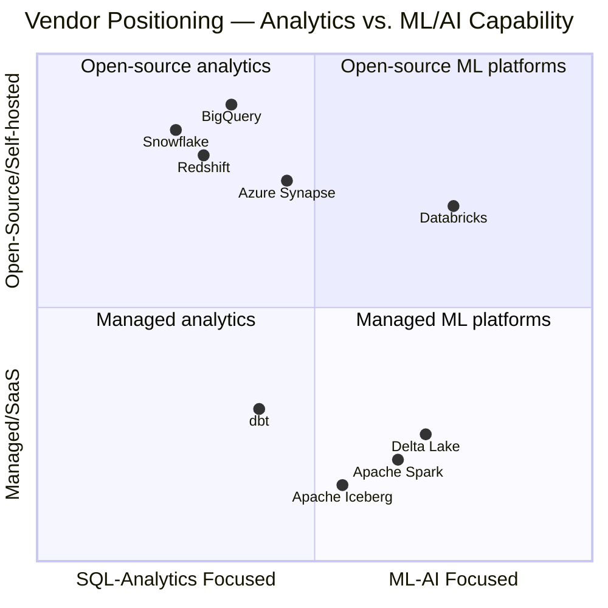
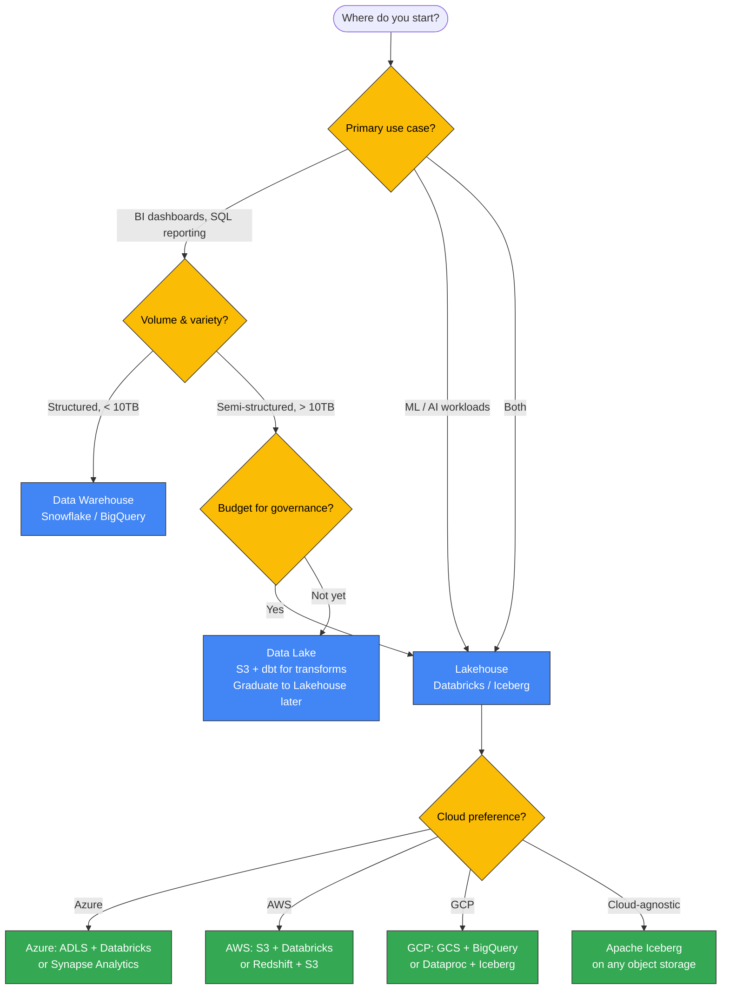
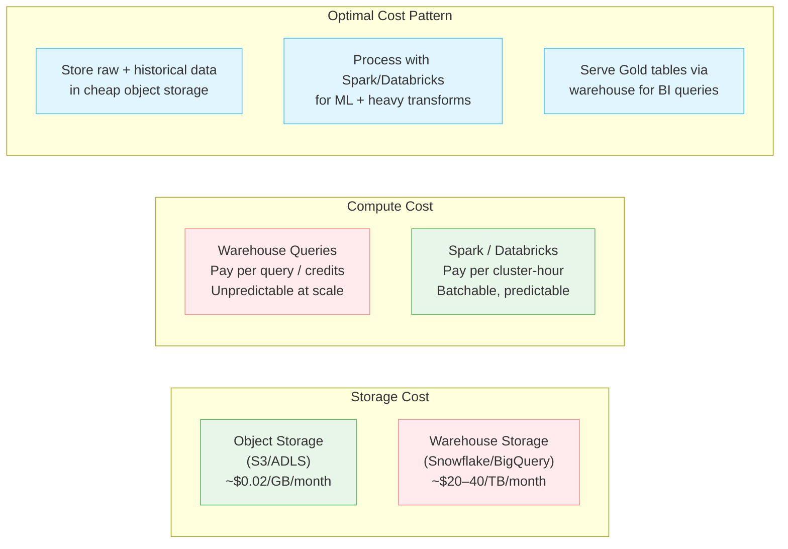

# Tech IQ #12: Data Lakes, Warehouses & Lakehouses — Picking the Right Storage Architecture
*The Decision That Determines Whether Your AI Strategy Succeeds or Stalls*

Leaders sign multi-million dollar contracts for Snowflake, Databricks, or Azure Data Lake without a clear picture of what each solves. Here's the map.

---

## Background

Every AI and analytics initiative runs on data storage infrastructure. Three paradigms dominate enterprise decisions today:

- **Data Warehouse**: Optimized for structured analytics and BI dashboards.
- **Data Lake**: Optimized for storing everything, in any format, at low cost.
- **Data Lakehouse**: A modern architecture that merges the benefits of both.

Choosing the wrong one doesn't just waste money — it becomes a multi-year anchor on your AI roadmap.

---

## The Evolution of Data Storage



---

## Three Architectures at a Glance

```mermaid
flowchart TB
    subgraph DW["Data Warehouse"]
        direction TB
        DW1[Structured data only\nCSV, SQL tables]
        DW2[Schema defined BEFORE loading\nSchema-on-write]
        DW3[Optimized for SQL queries\nBI and dashboards]
        DW4[High cost per GB\nExpensive to store everything]
        DW5[Examples: Snowflake, BigQuery,\nRedshift, Azure Synapse]
    end

    subgraph DL["Data Lake"]
        direction TB
        DL1[Any data format\nCSV, JSON, images, video, logs]
        DL2[Schema defined AT QUERY TIME\nSchema-on-read]
        DL3[Optimized for storage cost\nS3/ADLS at cents per GB]
        DL4[Poor query performance\nNo ACID transactions]
        DL5[Examples: AWS S3, Azure Data Lake\nStorage, GCS]
    end

    subgraph LH["Data Lakehouse"]
        direction TB
        LH1[Any data format\nlike a lake]
        LH2[ACID transactions + governance\nlike a warehouse]
        LH3[Optimized for both BI and ML]
        LH4[Open table format layer\nDelta Lake, Iceberg, Hudi]
        LH5[Examples: Databricks, Apache Iceberg\non S3, Delta Lake on Azure]
    end

    classDef dw fill:#e1f5fe,stroke:#4fc3f7;
    classDef dl fill:#fff8e1,stroke:#ffca28;
    classDef lh fill:#e8f5e9,stroke:#66bb6a;
    class DW,DW1,DW2,DW3,DW4,DW5 dw;
    class DL,DL1,DL2,DL3,DL4,DL5 dl;
    class LH,LH1,LH2,LH3,LH4,LH5 lh;
```



---

## The Full Comparison Table

| Dimension | Data Warehouse | Data Lake | Data Lakehouse |
|-----------|---------------|-----------|----------------|
| **Data types** | Structured only | Any format | Any format |
| **Schema** | Schema-on-write | Schema-on-read | Both supported |
| **Query performance** | Excellent | Poor to moderate | Excellent |
| **Storage cost** | High ($$$) | Low ($) | Low–Medium ($$) |
| **ACID transactions** | Yes | No | Yes |
| **ML/AI workloads** | Limited | Possible but clunky | Native support |
| **Real-time streaming** | Limited | Possible | Native (Delta Live Tables) |
| **Data governance** | Strong | Weak (data swamps) | Strong |
| **Best for** | BI, reporting, SQL analysts | Raw data storage, data science | Everything — BI + ML + AI |
| **Key vendors** | Snowflake, BigQuery, Redshift | AWS S3, Azure ADLS, GCS | Databricks, Apache Iceberg |

---

## How Data Flows Through a Modern Lakehouse



---

## The Medallion Architecture — The Operating Model

Most modern lakehouses organize data into three layers. Think of it as raw material → semi-finished → finished product.



---

## The Vendor Landscape



---

## The AI Readiness Dimension

Many leaders choose warehouses for analytics but then discover they can't run ML workloads efficiently on them. Here is how each architecture serves your AI roadmap:

```mermaid
flowchart TB
    subgraph WH["Data Warehouse for AI"]
        WH1[Good: SQL-based feature stores\nFamiliar to analysts]
        WH2[Bad: Can't store unstructured data\nImages, PDFs, logs need separate infra]
        WH3[Bad: Python ML frameworks need data\nextracted out — expensive egress]
    end

    subgraph LK["Data Lake for AI"]
        LK1[Good: Cheap to store all raw data\nImages, sensor logs, documents]
        LK2[Good: ML frameworks read S3 natively]
        LK3[Bad: No governance → data swamps\nScientists can't find clean data]
    end

    subgraph LH2["Lakehouse for AI"]
        LH1[Good: Unified platform for BI + ML]
        LH2[Good: Feature tables live next to raw data]
        LH3[Good: Vector search integrated\nDatabricks Vector Search, Iceberg + pgvector]
        LH4[Good: Streaming + batch in one platform]
    end

    classDef wh fill:#e1f5fe,stroke:#4fc3f7;
    classDef lk fill:#fff8e1,stroke:#ffca28;
    classDef lh fill:#e8f5e9,stroke:#66bb6a;
    class WH,WH1,WH2,WH3 wh;
    class LK,LK1,LK2,LK3 lk;
    class LH2,LH1,LH2,LH3,LH4 lh;
```

---

## Decision Framework for Leaders



---

## Common Pitfalls

| Pitfall | What Happens | How to Avoid |
|---------|-------------|--------------|
| **Data Swamp** | Lake fills with undocumented, unmaintained data. No one can find anything. | Enforce naming conventions + data catalog from day one (Apache Atlas, Collibra, Unity Catalog) |
| **Warehouse Lock-in** | All data in Snowflake. ML team can't run Python jobs efficiently. High egress costs. | Keep raw data in open formats (Parquet/Iceberg) in object storage |
| **Schema chaos in Bronze** | Every team lands data differently — dates as strings, nulls as "N/A" | Enforce a schema contract at ingestion using schema registry |
| **Gold layer sprawl** | 200 "final" tables, no one knows which is authoritative | Ownership tags + freshness SLAs per Gold table |
| **Treating streaming like batch** | Real-time sensor data arrives every second; batch jobs run every 6 hours | Separate streaming ingestion paths (Kafka → Bronze) |

---

## Cost Architecture Insight



---

## Key Takeaways

1. **Data Warehouses are not dead** — they are excellent for structured analytics at governed scale. Snowflake and BigQuery are production-grade for BI.
2. **Pure Data Lakes become data swamps** without governance. The Hadoop era taught this the hard way.
3. **The Lakehouse is the AI-era default** — open table formats (Delta Lake, Iceberg) give you warehouse-grade reliability at lake-grade cost.
4. **The Medallion Architecture is your organizing principle** — Bronze → Silver → Gold maps to raw → trusted → business-ready.
5. **Your AI roadmap depends on this foundation** — RAG pipelines, feature stores, and ML training all run on top of your data storage architecture.

---

## FAQ for Non-Tech Leaders

❓ *"We already pay for Snowflake. Should we move to Databricks?"*
**Answer**: Not necessarily. Use Snowflake for your BI and SQL workloads. Add Databricks (or open-source Spark + Iceberg) for ML workloads. Many enterprises run both — it is not an either/or decision.

❓ *"What is dbt and why do I keep hearing about it?"*
**Answer**: dbt (data build tool) is a transformation framework that runs SQL transforms inside your warehouse. It adds software engineering practices (version control, testing, documentation) to data transformation. It works on top of both warehouses and lakehouses.

❓ *"Our data is in Excel files and SharePoint. Where do we even start?"*
**Answer**: Start with a Data Lake (cheap object storage like Azure ADLS or AWS S3) as your landing zone. Bring all files in raw. Then build the Silver transformation layer. A full Lakehouse comes after you establish data ingestion discipline.

---

Simplifying tech for decisive leadership. Connect with me on [LinkedIn](https://www.linkedin.com/in/arockialiborious/) for real-talk AI insights.
