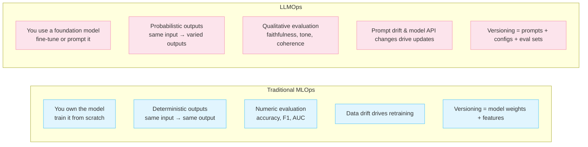
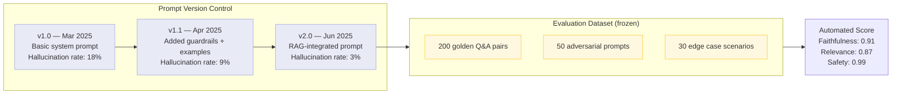
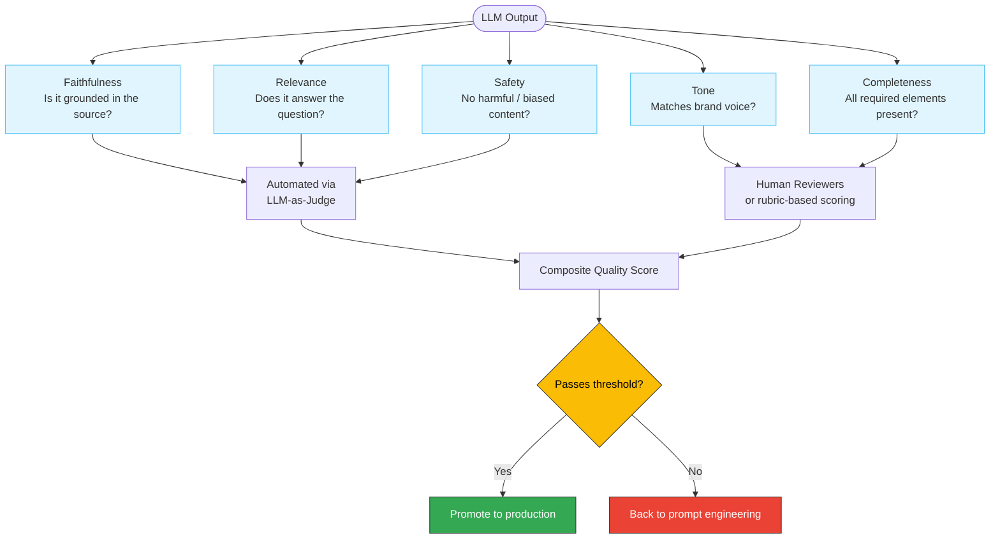
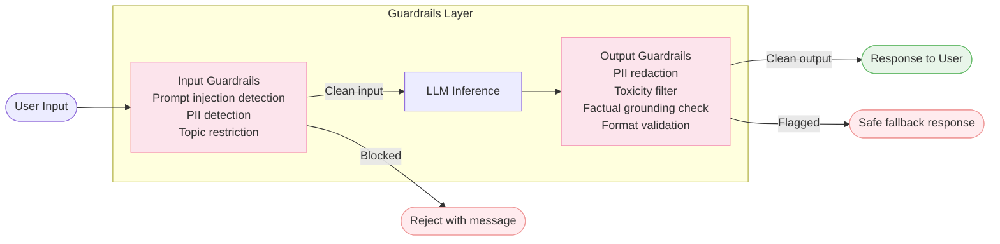
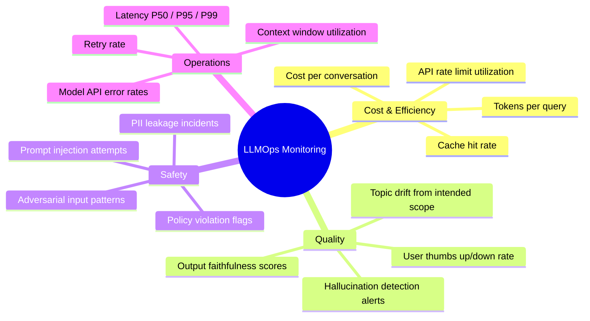
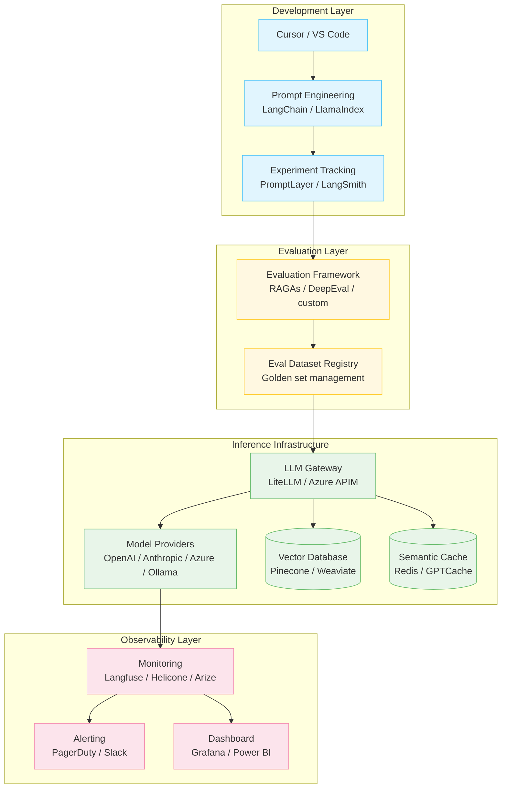

# Tech IQ #11: MLOps vs. LLMOps — Why Deploying LLMs Is a Different Beast
*Your ML Playbook Needs an Upgrade for the Age of Foundation Models*

You've mastered CI/CD for ML. You have model versioning, retraining pipelines, and drift monitors. Now your team wants to ship a GPT-4 powered product — and suddenly none of the old playbook quite fits.

---

## Background

MLOps is the discipline of taking machine learning models from experimentation to production reliably. It evolved to solve real problems: models degrade over time, training pipelines break, data quality varies, and deployment without governance creates chaos.

**LLMOps** is MLOps' younger, more complex sibling — built for the specific challenges of deploying Large Language Models at scale. The differences are not cosmetic. They fundamentally change your tooling, team structure, and risk surface.

---

## The Core Distinction

---

## Side-by-Side Comparison

| Dimension | MLOps | LLMOps |
|-----------|-------|--------|
| **Model ownership** | You train from scratch | You use/fine-tune a foundation model |
| **Primary artifact** | Trained model weights | Prompts, system instructions, RAG config |
| **Input** | Structured features (numbers, categories) | Unstructured text, images, audio |
| **Output** | Numeric score or class label | Open-ended natural language |
| **Evaluation** | RMSE, F1, AUC — automated | Human eval + LLM-as-judge + rubrics |
| **Failure mode** | Model predicts wrong class | Model hallucinates, leaks PII, goes off-topic |
| **Drift detection** | Statistical test on feature distributions | Semantic drift, output quality degradation |
| **Retraining trigger** | Data distribution shift | Prompt effectiveness decay, API model version change |
| **Key versioning objects** | Model weights, datasets, features | Prompts, few-shot examples, eval benchmarks |
| **Cost driver** | GPU compute for training | Token consumption at inference |
| **Security risk** | Data poisoning, adversarial inputs | Prompt injection, jailbreaks, data leakage |

---

## The MLOps Lifecycle vs. LLMOps Lifecycle

```mermaid
flowchart TB
    subgraph MLOPS["Traditional MLOps Lifecycle"]
        direction LR
        A1[Data Collection] --> A2[Feature Engineering]
        A2 --> A3[Model Training\nGPU hours]
        A3 --> A4[Evaluation\nMetrics vs. baseline]
        A4 --> A5[Packaging\nDocker image]
        A5 --> A6[Deployment\nKubernetes / endpoint]
        A6 --> A7[Monitoring\nData drift + prediction drift]
        A7 --> |Drift detected| A3
    end

    subgraph LLMOPS["LLMOps Lifecycle"]
        direction LR
        B1[Use Case Definition\n+ Eval Dataset Creation] --> B2[Prompt Engineering\nSystem prompt, few-shots]
        B2 --> B3[Retrieval Setup\nRAG pipeline, vector DB]
        B3 --> B4[Evaluation\nHuman + automated evals]
        B4 --> B5[Guardrails & Filters\nOutput validation]
        B5 --> B6[Deployment\nAPI gateway + rate limits]
        B6 --> B7[Monitoring\nLatency, cost, quality, safety]
        B7 --> |Quality regression| B2
        B7 --> |Model API updated| B4
    end

    classDef ml fill:#e1f5fe,stroke:#4fc3f7;
    classDef llm fill:#e8f5e9,stroke:#66bb6a;
    class A1,A2,A3,A4,A5,A6,A7 ml;
    class B1,B2,B3,B4,B5,B6,B7 llm;
```

---

## The New Challenge: Prompt Versioning

In traditional ML, you version your model weights. In LLMOps, your **prompt is the product** — and it must be versioned with the same discipline.

---

## LLM Evaluation — The Hard Part

Traditional model evaluation is automated and numeric. LLM evaluation is multi-dimensional and partially human.

---

## The Guardrails Layer — New in LLMOps

Traditional ML models don't go rogue. LLMs can — and they require an explicit safety layer.

---

## Monitoring: What Changes in LLMOps

---

## The LLMOps Stack

---

## Common LLMOps Failure Patterns

| Failure | Description | Prevention |
|---------|-------------|------------|
| **Prompt drift** | Model API silently updates; old prompts produce degraded output | Regression eval suite runs on every model version change |
| **Cost explosion** | Verbose prompts + high traffic = unexpected token bills | Token budgets, caching, shorter prompt templates |
| **Hallucination in prod** | Model confidently states incorrect facts | RAG grounding + output faithfulness checks |
| **Prompt injection** | Malicious users override system instructions via input | Input sanitization + instruction hierarchy enforcement |
| **Latency regression** | Adding RAG adds retrieval round-trip latency | Semantic caching + async retrieval patterns |
| **Eval set leakage** | Test examples end up in training data, inflating scores | Strict separation of eval sets from any training pipeline |

---

## Key Takeaways

1. **Prompts are code.** Version them, test them, review them like you do source code.
2. **Evaluation is the hardest part of LLMOps** — and it never ends. Build a golden dataset on day one.
3. **Guardrails are not optional** — they are the difference between a demo and a production-grade product.
4. **Token cost is your new compute cost.** Instrument it from the start or face surprise bills.
5. **Your MLOps team can adopt LLMOps** — but they need to unlearn the assumption that model retraining is the primary lever.

---

## FAQ for Non-Tech Leaders

❓ *"We already have an MLOps platform — can we just use that?"*
**Answer**: Partially. MLOps platforms handle experiment tracking and model registry well. But prompt versioning, LLM evaluation frameworks, and guardrails are new layers that most MLOps tools don't cover yet. Expect to add specialized tooling.

❓ *"How do we know if our LLM product is getting worse over time?"*
**Answer**: Run your golden evaluation dataset against the production system on a scheduled basis. If faithfulness or relevance scores drop, something changed — your prompt, the underlying model API, or your data.

❓ *"Who owns this in the org — data science or engineering?"*
**Answer**: Both. Prompt engineering and evaluation sit with AI/data science. Inference infrastructure, monitoring, and guardrails sit with ML engineering. The seam between them is the new organizational challenge.

---

Simplifying tech for decisive leadership. Connect with me on [LinkedIn](https://www.linkedin.com/in/arockialiborious/) for real-talk AI insights.
