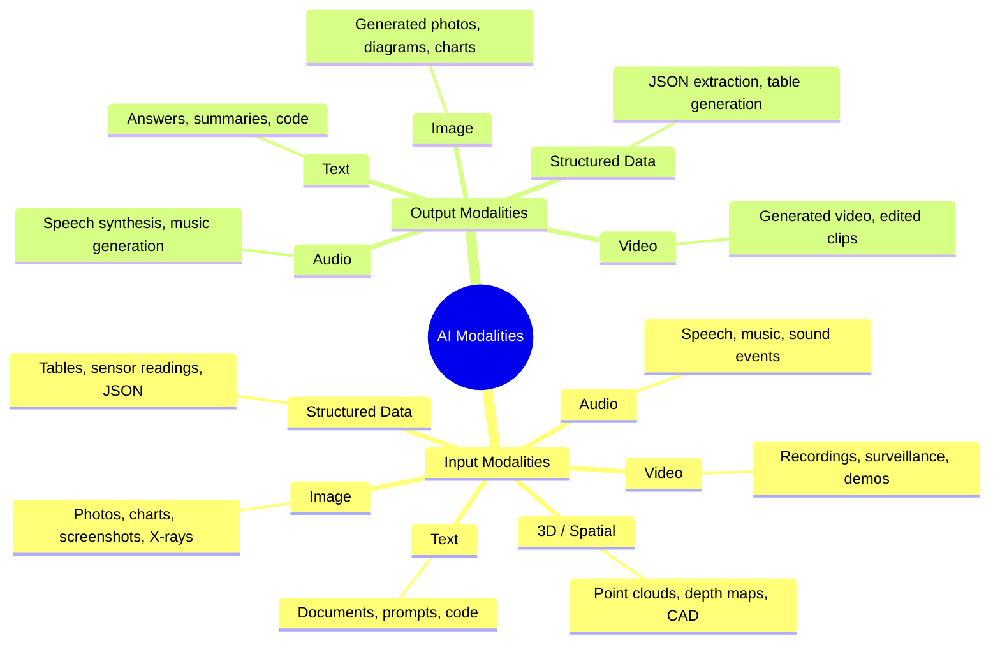
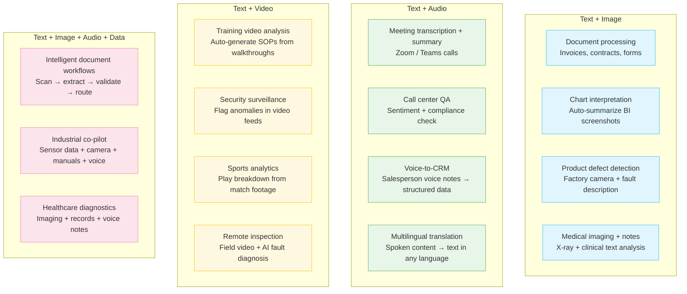
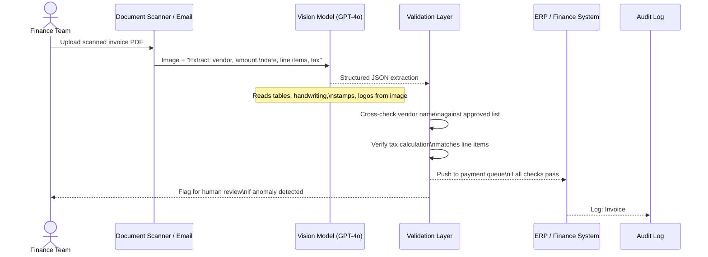
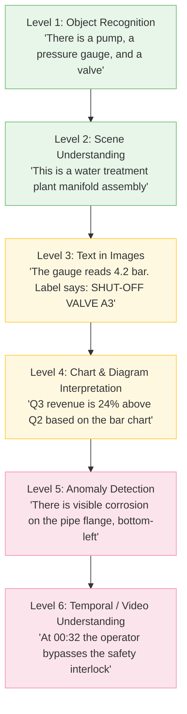
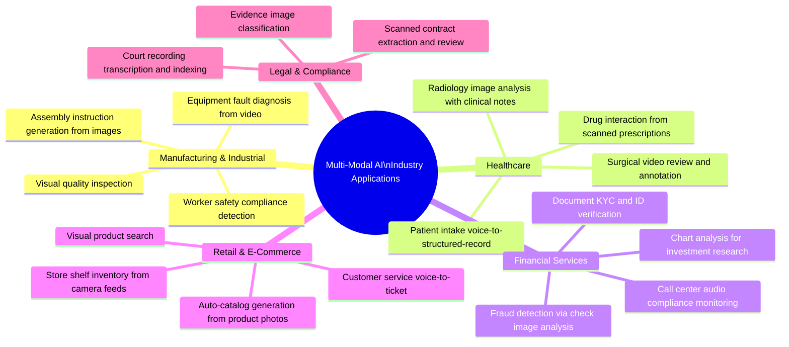
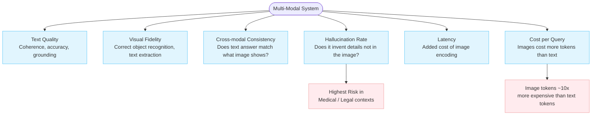
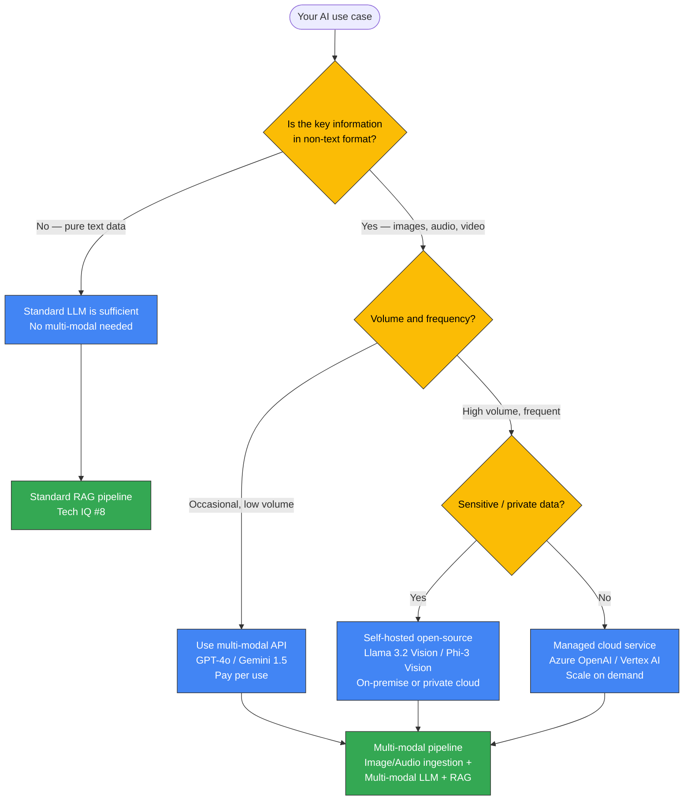

# Tech IQ #15: Multi-Modal AI — When Your Model Can See, Hear, and Read
*Beyond Text: The AI Systems That Perceive the World Like Humans Do*

The first generation of enterprise AI was text-in, text-out. The next generation processes the world the way your best analyst does — reading documents, looking at charts, watching videos, and listening to conversations — all at once.

---

## Background

A **modality** is a type of input or output: text, images, audio, video, structured data, code. A **multi-modal AI model** processes two or more modalities simultaneously or in combination.

When GPT-4o reads a handwritten maintenance log, describes what's in a factory floor photo, and answers questions about both in one conversation — that is multi-modal AI in practice.

This shift from single-modality to multi-modality is arguably the biggest practical expansion of what AI can automate in the next five years.

---

## The Modality Landscape



---

## How Multi-Modal Models Work

At the core, multi-modal models learn to embed different types of data into a **shared semantic space** — the same space where text embeddings live (as covered in Tech IQ #9).

```mermaid
flowchart LR
    subgraph Inputs["Raw Inputs"]
        I1[Text\n"Describe this chart"]
        I2[Image\nBarChart.png]
        I3[Audio\nVoice question.mp3]
    end

    subgraph Encoders["Modality-Specific Encoders"]
        TE[Text Encoder\nTokenizer + Transformer]
        IE[Image Encoder\nViT / CLIP / ConvNet]
        AE[Audio Encoder\nWhisper / Wav2Vec]
    end

    subgraph Shared["Shared Representation Space"]
        ALIGN["Aligned Embedding Space\nAll modalities mapped to\ncommon vector dimension"]
    end

    subgraph Decode["Generation / Output"]
        LLM[LLM Decoder\nAttends across all modalities]
        OUT[Output\n"Q3 revenue grew 24%,\ndriven by APAC expansion"]
    end

    I1 --> TE --> ALIGN
    I2 --> IE --> ALIGN
    I3 --> AE --> ALIGN
    ALIGN --> LLM --> OUT

    classDef input fill:#e1f5fe,stroke:#4fc3f7;
    classDef encoder fill:#fff8e1,stroke:#ffca28;
    classDef shared fill:#e8f5e9,stroke:#66bb6a;
    classDef output fill:#fce4ec,stroke:#f48fb1;

    class I1,I2,I3 input;
    class TE,IE,AE encoder;
    class ALIGN shared;
    class LLM,OUT output;
```

---

## Key Multi-Modal Models in 2025–2026

| Model | Provider | Modalities Supported | Best Known For |
|-------|----------|----------------------|----------------|
| **GPT-4o** | OpenAI | Text, Image, Audio (native) | Fastest, most balanced enterprise model |
| **Gemini 1.5 Pro / 2.0** | Google | Text, Image, Audio, Video, Code | 1M+ token context window; video understanding |
| **Claude 3.5 Sonnet** | Anthropic | Text, Image (Documents) | Document analysis, precision in long-form |
| **Llama 3.2 Vision** | Meta | Text, Image | Open-source, self-hostable vision model |
| **Whisper** | OpenAI | Audio → Text | Speech transcription benchmark |
| **DALL-E 3 / Imagen 3** | OpenAI / Google | Text → Image | High-fidelity image generation |
| **Sora / Veo 2** | OpenAI / Google | Text → Video | Long-form video generation |
| **Phi-3 Vision** | Microsoft | Text, Image | Small, efficient, on-device capable |

---

## Enterprise Use Cases by Modality Combination



---

## A Multi-Modal Pipeline in Practice

**Example: Intelligent Invoice Processing**



---

## The Vision Capability Stack

Understanding what "image understanding" actually means — from simple to complex:



---

## Architecture: Multi-Modal RAG

When you combine multi-modal AI with retrieval (from Tech IQ #8 and #9), you get systems that can search across images, text, and audio simultaneously.

```mermaid
flowchart LR
    subgraph Index["Multi-Modal Index"]
        T1[Text documents] --> TE2[Text Encoder] --> VDB[(Vector DB)]
        I1[Images / charts] --> IE2[Image Encoder\nCLIP / ViT] --> VDB
        A1[Audio recordings] --> AE2[Audio Encoder\nWhisper → Text → Embed] --> VDB
    end

    subgraph Query["Query Time"]
        Q([User Query\n"Show me reports with pump failure images\nfrom Q3"]) --> QEmbed[Multi-modal\nQuery Encoder]
        QEmbed --> Search[Cross-modal\nSemantic Search]
        VDB --> Search
        Search --> Retrieved["Retrieved:\n📄 Maintenance report text\n🖼️ Fault image from camera #4\n🔊 Engineer voice note transcript"]
        Retrieved --> LLM2[Multi-modal LLM\nGPT-4o / Gemini]
        LLM2 --> Answer([Grounded answer\nwith image + text evidence])
    end

    classDef index fill:#e1f5fe,stroke:#4fc3f7;
    classDef query fill:#e8f5e9,stroke:#66bb6a;
    class T1,I1,A1,TE2,IE2,AE2,VDB index;
    class Q,QEmbed,Search,Retrieved,LLM2,Answer query;
```

---

## Industry Applications



---

## What Multi-Modal AI Cannot Do (Yet)

| Limitation | Current State | Implication |
|------------|--------------|-------------|
| **Real-time video** | Most models process video as frames, not true real-time streams | Live surveillance requires specialized models (YOLO, etc.) |
| **3D spatial understanding** | Nascent — requires point cloud models | CAD/BIM automation still needs dedicated tools |
| **Audio event detection** | Mostly converts audio to text first | Industrial sound anomaly detection needs specialized audio models |
| **Long video (hours)** | Gemini 1.5 handles ~1hr; Sora generates short clips | Full-length meeting analysis requires chunking strategies |
| **Cross-modal reasoning** | Still degrades with complex multi-step reasoning across 3+ modalities | Complex industrial co-pilots need careful prompt and architecture design |

---

## Evaluation Dimensions for Multi-Modal AI



---

## Decision Guide: Do You Need Multi-Modal AI?



---

## Cost Reality

| Input Type | Approximate Token Cost (GPT-4o) | Notes |
|------------|--------------------------------|-------|
| 1,000 text tokens | $0.005 | Baseline |
| 1 image (low-res) | ~85 tokens equivalent | ~$0.0004 |
| 1 image (high-res, 1024×1024) | ~765 tokens equivalent | ~$0.004 |
| 1 minute of audio | ~600 text tokens (after transcription) | Whisper transcription + LLM processing |
| 1 minute of video (1fps) | ~60 image tokens | Processed as frame sequence |

**Key Insight**: High-resolution image analysis at scale gets expensive quickly. Architect your pipeline to use low-resolution thumbnails for triage and high-resolution processing only when needed.

---

## Key Takeaways

1. **Multi-modal AI eliminates the "digitize first" bottleneck.** Documents, photos, and voice notes no longer need manual pre-processing before AI can use them.
2. **Image tokens are more expensive than text tokens.** Design pipelines that triage with low-res before escalating to high-res processing.
3. **The biggest enterprise opportunity is document automation.** Invoices, contracts, forms, and reports that are images or PDFs are now directly processable at scale.
4. **Industrial applications are uniquely powerful.** Equipment photos + maintenance logs + sensor readings, all in one AI reasoning session, changes what field operations can do.
5. **Hallucinations are more dangerous in visual domains.** A model that invents text it "reads" from an image is harder to detect than a text hallucination. Evaluation and human-in-the-loop checkpoints matter more here.

---

## FAQ for Non-Tech Leaders

❓ *"Can we use GPT-4o to process thousands of scanned invoices per day?"*
**Answer**: Yes — but architect it carefully. Batch processing, caching for duplicate layouts, and structured extraction validation are required at that volume. At 1,000 invoices/day with one image each, expect roughly $4–15/day in API costs depending on resolution — highly cost-effective vs. manual processing.

❓ *"Is video understanding reliable enough for production?"*
**Answer**: For offline video analysis (meeting summaries, training videos, recorded inspections), yes. For real-time live video, purpose-built computer vision systems (not general LLMs) are still more appropriate.

❓ *"How does multi-modal AI handle documents with both text and tables?"*
**Answer**: Vision models extract both — they "see" the layout. For structured extraction from tables in PDFs, combining vision-based extraction with validation logic gives >95% accuracy on clean scans. Handwritten or low-quality scans require additional processing steps.

---

Simplifying tech for decisive leadership. Connect with me on [LinkedIn](https://www.linkedin.com/in/arockialiborious/) for real-talk AI insights.
