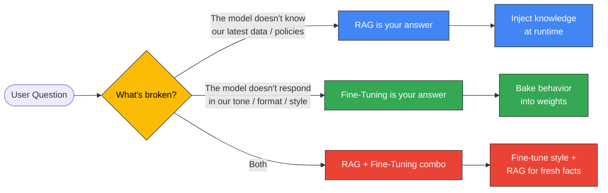
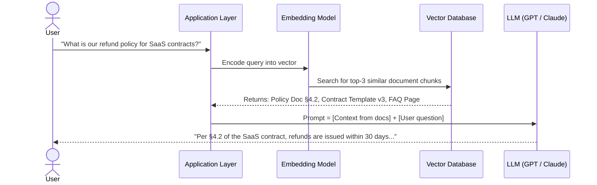
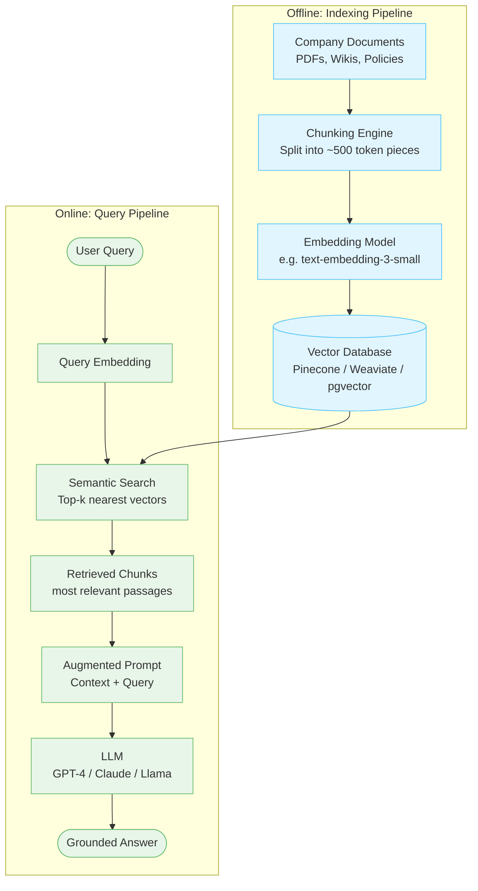
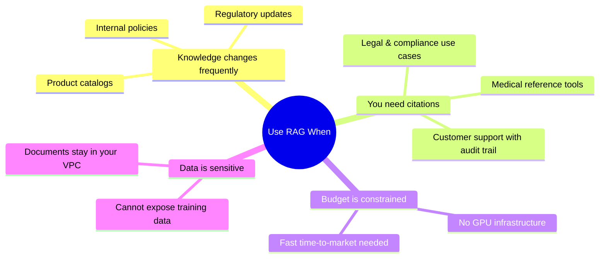
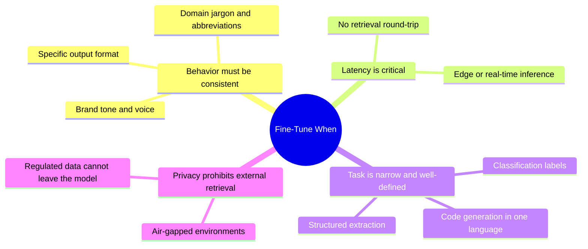
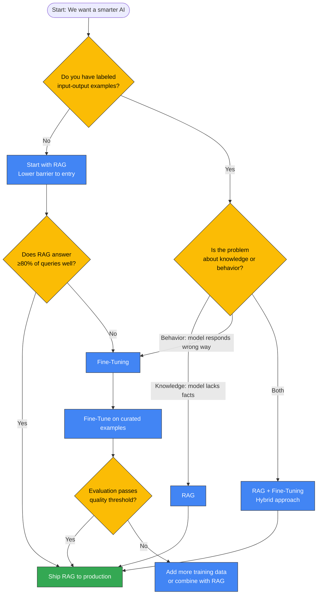

# Tech IQ #8: RAG vs. Fine-Tuning — When to Customize Your LLM
*The Most Misunderstood Strategy Decision in Enterprise AI*

The question isn't "should we improve our model?" It's "are we solving a retrieval problem or a behavior problem?"

---

## Background

Every leader deploying AI eventually asks: *"Can we make this model smarter about our business?"* The answer is yes — but how you get there depends entirely on **what kind of smarter** you need.

Two dominant approaches exist:
- **RAG (Retrieval-Augmented Generation)**: Give the model access to your documents at query time.
- **Fine-Tuning**: Retrain the model on your data so it internalizes your domain.

Choosing wrong wastes months and hundreds of thousands of dollars.

---

## The Core Mental Model

---

## What is RAG?

RAG is a two-step process: **retrieve** relevant context from your knowledge base, then **augment** the LLM's prompt with that context before generating an answer.

The model itself is never changed — you are simply feeding it better information at the moment of the query.

### How RAG Works — Step by Step

### RAG Architecture

---

## What is Fine-Tuning?

Fine-tuning takes a pre-trained model and continues training it on your curated dataset. The model's **internal weights** are updated — it learns your terminology, tone, output format, and domain conventions without needing external prompts.

### Fine-Tuning Lifecycle

```mermaid
flowchart LR
    subgraph Prep["1. Data Preparation"]
        Raw[Raw Examples\nInput-Output pairs] --> Clean[Clean & Format\nJSONL / Instruction format]
        Clean --> Split[Train / Validation\n80/20 split]
    end

    subgraph Train["2. Training"]
        Split --> Base[Base Model\ne.g. Llama 3, GPT-3.5]
        Base --> FT[Fine-Tuning Job\nGPU hours]
        FT --> Eval[Evaluation\nLoss, BLEU, task metrics]
    end

    subgraph Deploy["3. Deployment"]
        Eval --> |Passes threshold| Reg[Model Registry\nVersioned artifact]
        Reg --> Serve[Model Serving\nAPI endpoint]
        Serve --> Monitor[Production Monitoring\nDrift, latency, quality]
    end

    classDef prep fill:#fff8e1,stroke:#ffca28;
    classDef train fill:#fce4ec,stroke:#f48fb1;
    classDef deploy fill:#e8eaf6,stroke:#9fa8da;
    class Raw,Clean,Split prep;
    class Base,FT,Eval train;
    class Reg,Serve,Monitor deploy;
```

---

## Head-to-Head Comparison

| Dimension | RAG | Fine-Tuning |
|-----------|-----|-------------|
| **Best for** | Fresh, dynamic, domain-specific knowledge | Consistent tone, format, task behavior |
| **Data needed** | Documents (no labeling required) | Labeled input-output examples (hundreds to thousands) |
| **Cost to implement** | Low–Medium (indexing + vector DB) | High (GPU compute + data prep) |
| **Time to production** | Days to weeks | Weeks to months |
| **Handles real-time data** | Yes — update the index | No — requires retraining |
| **Hallucination risk** | Lower (grounded in retrieved text) | Higher (model interpolates from training) |
| **Explainability** | High — you can show the source chunk | Low — answers come from baked-in weights |
| **Customizes style/behavior** | Partially (via prompt) | Fully |
| **Infra complexity** | Vector DB + retrieval pipeline | GPU cluster + training orchestration |

---

## When RAG Wins

## When Fine-Tuning Wins

---

## The Decision Framework for Leaders

---

## Real-World Scenarios

### Scenario A — Legal Document Assistant
A law firm wants AI to answer questions about contracts stored in SharePoint.

**Answer: RAG**
- Documents change weekly.
- Lawyers need citations to specific clauses.
- Fine-tuning would require thousands of labeled QA pairs and would go stale.

---

### Scenario B — Customer Support Bot for a SaaS Product
The team wants the bot to always respond in the product's friendly tone, use internal feature names correctly, and never suggest competitor alternatives.

**Answer: Fine-Tuning**
- Tone and behavior are baked into the task, not the knowledge base.
- The training dataset is: real support tickets → ideal human-written replies.

---

### Scenario C — Industrial Maintenance Advisor
A manufacturer wants AI to diagnose equipment faults using both sensor readings (real-time) and historical maintenance manuals (static).

**Answer: RAG + Fine-Tuning**
- Fine-tune on maintenance report language and fault diagnosis patterns.
- RAG retrieves relevant manual sections at query time.

---

## Cost Reality Check

| Approach | Setup Cost | Monthly Operating Cost | Data Required |
|----------|-----------|------------------------|---------------|
| RAG (small scale) | $5k–$15k | $500–$2k (API + vector DB) | Existing documents |
| Fine-Tuning (GPT-3.5) | $20k–$50k | $2k–$5k | 1,000+ labeled pairs |
| Fine-Tuning (open source, on-prem) | $50k–$150k | $8k–$20k (GPU servers) | 5,000+ labeled pairs |
| RAG + Fine-Tuning hybrid | $40k–$100k | $3k–$8k | Both above |

**Leadership Takeaway**: RAG is the right default starting point. Graduate to fine-tuning only when you have a specific behavioral gap that retrieval cannot fix.

---

## Key Takeaways

1. **RAG = knowledge injection at runtime.** The model is unchanged. Your documents are the intelligence.
2. **Fine-Tuning = behavioral reprogramming.** The model changes. Your examples are the teacher.
3. **Most enterprise problems start as RAG problems.** Fresh data, compliance requirements, and audit trails favor retrieval.
4. **Fine-Tuning requires labeled data discipline.** Garbage in, garbage behavior out.
5. **The hybrid is powerful but expensive.** Only pursue it when you have proven both approaches individually.

---

## FAQ for Non-Tech Leaders

❓ *"Can't we just put everything in the system prompt?"*
**Answer**: You can — until you hit the context window limit (~100k tokens for most models). RAG selectively retrieves only what's relevant, which is cleaner and cheaper.

❓ *"Does fine-tuning make the model permanently smarter?"*
**Answer**: It makes it permanently different — optimized for your task. But it won't know about events after its training cutoff, which is why RAG still complements it.

❓ *"How long does fine-tuning take?"*
**Answer**: Data preparation: 2–6 weeks. Training: hours to days. Evaluation and iteration: 2–4 weeks. Budget 6–10 weeks end-to-end for a first run.

---

Simplifying tech for decisive leadership. Connect with me on [LinkedIn](https://www.linkedin.com/in/arockialiborious/) for real-talk AI insights.
