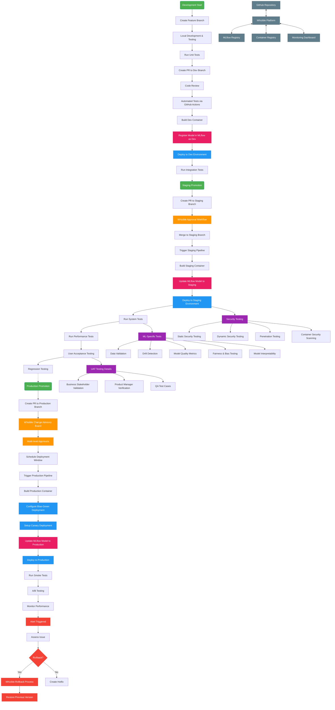

# Tech-IQ
From Bytes to Boardrooms: Tech Wisdom for Modern Leaders

```mermaid
flowchart TD
    %% Development Environment
    dev_start(Development Start) --> feature_branch[Create Feature Branch]
    feature_branch --> local_dev[Local Development & Testing]
    local_dev --> unit_tests[Run Unit Tests]
    unit_tests --> feature_pr[Create PR to Dev Branch]
    feature_pr --> code_review[Code Review]
    code_review --> dev_auto_tests[Automated Tests via GitHub Actions]
    dev_auto_tests --> dev_build[Build Dev Container]
    dev_build --> dev_mlflow[Register Model in MLflow as Dev]
    dev_mlflow --> dev_deploy[Deploy to Dev Environment]
    dev_deploy --> integration_test[Run Integration Tests]
    
    %% Staging Environment
    integration_test -.-> stg_start
    stg_start(Staging Promotion) --> staging_pr[Create PR to Staging Branch]
    staging_pr --> whizible_approval[Whizible Approval Workflow]
    whizible_approval --> merge_staging[Merge to Staging Branch]
    merge_staging --> stg_pipeline[Trigger Staging Pipeline]
    stg_pipeline --> stg_build[Build Staging Container]
    stg_build --> stg_mlflow[Update MLflow Model to Staging]
    stg_mlflow --> stg_deploy[Deploy to Staging Environment]
    stg_deploy --> system_test[Run System Tests]
    system_test --> perf_test[Run Performance Tests]
    perf_test --> uat[User Acceptance Testing]
    uat --> regression_test[Regression Testing]
    
    %% Production Environment
    regression_test -.-> prod_start
    prod_start(Production Promotion) --> prod_pr[Create PR to Production Branch]
    prod_pr --> whizible_cab[Whizible Change Advisory Board]
    whizible_cab --> multi_approval[Multi-level Approvals]
    multi_approval --> schedule_deploy[Schedule Deployment Window]
    schedule_deploy --> prod_pipeline[Trigger Production Pipeline]
    prod_pipeline --> prod_build[Build Production Container]
    prod_build --> blue_green[Configure Blue-Green Deployment]
    blue_green --> canary[Setup Canary Deployment]
    canary --> prod_mlflow[Update MLflow Model to Production]
    prod_mlflow --> prod_deploy[Deploy to Production]
    prod_deploy --> smoke_test[Run Smoke Tests]
    smoke_test --> ab_test[A/B Testing]
    ab_test --> monitor[Monitor Performance]
    
    %% Testing Processes
    uat --> uat_detail[UAT Testing Details]
    uat_detail --> biz_valid[Business Stakeholder Validation]
    uat_detail --> product_valid[Product Manager Verification]
    uat_detail --> qa_cases[QA Test Cases]
    
    system_test --> ml_tests[ML-Specific Tests]
    ml_tests --> data_valid[Data Validation]
    ml_tests --> drift_detect[Drift Detection]
    ml_tests --> model_quality[Model Quality Metrics]
    ml_tests --> fairness[Fairness & Bias Testing]
    ml_tests --> explain[Model Interpretability]
    
    stg_deploy --> sec_tests[Security Testing]
    sec_tests --> sast[Static Security Testing]
    sec_tests --> dast[Dynamic Security Testing]
    sec_tests --> pen_test[Penetration Testing]
    sec_tests --> container_scan[Container Security Scanning]
    
    %% Tools Integration
    github[GitHub Repository] <--> whizible[Whizible Platform]
    whizible <--> mlflow[MLflow Registry]
    whizible <--> docker[Container Registry]
    whizible <--> monitoring[Monitoring Dashboard]
    
    %% Rollback Processes
    monitor -.-> alert[Alert Triggered]
    alert --> assess[Assess Issue]
    assess --> rollback_decision{Rollback?}
    rollback_decision -->|Yes| whizible_rollback[Whizible Rollback Process]
    rollback_decision -->|No| hotfix[Create Hotfix]
    whizible_rollback --> previous_version[Restore Previous Version]
    
    %% Styling
    style dev_start fill:#4CAF50,stroke:#009688,color:white
    style stg_start fill:#4CAF50,stroke:#009688,color:white
    style prod_start fill:#4CAF50,stroke:#009688,color:white
    
    style whizible_approval fill:#FF9800,stroke:#F57C00,color:white
    style multi_approval fill:#FF9800,stroke:#F57C00,color:white
    style whizible_cab fill:#FF9800,stroke:#F57C00,color:white
    
    style dev_deploy fill:#2196F3,stroke:#1976D2,color:white
    style stg_deploy fill:#2196F3,stroke:#1976D2,color:white
    style prod_deploy fill:#2196F3,stroke:#1976D2,color:white
    style blue_green fill:#2196F3,stroke:#1976D2,color:white
    style canary fill:#2196F3,stroke:#1976D2,color:white
    
    style dev_mlflow fill:#E91E63,stroke:#C2185B,color:white
    style stg_mlflow fill:#E91E63,stroke:#C2185B,color:white
    style prod_mlflow fill:#E91E63,stroke:#C2185B,color:white
    
    style uat_detail fill:#9C27B0,stroke:#7B1FA2,color:white
    style ml_tests fill:#9C27B0,stroke:#7B1FA2,color:white
    style sec_tests fill:#9C27B0,stroke:#7B1FA2,color:white
    
    style github fill:#607D8B,stroke:#455A64,color:white
    style whizible fill:#607D8B,stroke:#455A64,color:white
    style mlflow fill:#607D8B,stroke:#455A64,color:white
    style docker fill:#607D8B,stroke:#455A64,color:white
    style monitoring fill:#607D8B,stroke:#455A64,color:white
    
    style alert fill:#F44336,stroke:#D32F2F,color:white
    style rollback_decision fill:#F44336,stroke:#D32F2F,color:white
    style whizible_rollback fill:#F44336,stroke:#D32F2F,color:white
    style previous_version fill:#F44336,stroke:#D32F2F,color:white
```
