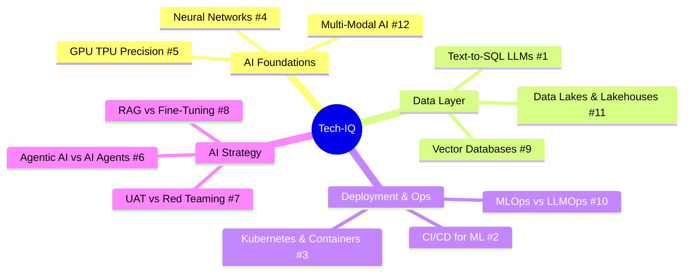

# 🧠 Tech-IQ: From Bytes to Boardrooms  
*Curated Tech Wisdom for Strategic Leaders*

Welcome to **Tech-IQ** — a no-jargon, executive-savvy series designed to decode complex AI/ML technologies and infrastructure for business leaders, architects, and modern decision-makers. Each edition is designed as a standalone capsule of clarity — explaining not just how the tech works.

---

## 🔍 Tech-IQ Series Highlights

### 🧙‍♂️ [Tech IQ #1: LLMs Aren't Magic Wands!](https://github.com/itsual/Tech-IQ/tree/main/Text-2-SQL-LLM-ISNT-MAGIC)
📂 **Topic:** `Text-2-SQL-LLM-ISNT-MAGIC`  
🧠 **Insight:** Text-to-SQL with LLMs isn't plug-and-play magic. It demands schema awareness, guardrails, and validation.  
🔧 **Reality:** LLMs are autocomplete machines, not certified SQL analysts. Expect hallucinations unless you structure the context carefully.

---

### 🚀 [Tech IQ #2: CI/CD for ML—It's Not Just "Pushing Buttons"](https://github.com/itsual/Tech-IQ/tree/main/CI-CD)
📂 **Topic:** `CI-CD`  
🧠 **Insight:** CI/CD in ML includes retraining triggers, dataset versioning, evaluation thresholds—not just Git commits.  
🔧 **Reality:** ML CI/CD pipelines look like DevOps with data and statistical checkpoints woven in.

---

### 🛠️ [Tech IQ #3: Kubernetes, Containers & the Hidden Plumbing of AI](https://github.com/itsual/Tech-IQ/tree/main/Kubernetes%20Containers%20%26%20More)
📂 **Topic:** `Kubernetes Containers & More`  
🧠 **Insight:** Kubernetes is not a buzzword—it's the invisible backbone that scales AI, ensures resilience, and manages workloads.  
🔧 **Reality:** No YAML, no scale. Your model may be 99% accurate but 100% offline without orchestration.

---

### 🧬 [Tech IQ #4: How Neural Networks Work – From Neurons to Transformers](https://github.com/itsual/Tech-IQ/tree/main/Neural%20Network)
📂 **Topic:** `Neural Network`  
🧠 **Insight:** Neural networks mimic neurons in name, but function as sophisticated algebraic graph flows.  
🔧 **Reality:** From perceptrons to transformers, the secret lies in how information is weighted and passed—not in "intelligence."

---

### ⚙️ [Tech IQ #5: AI Compute & Precision — A Leader's Infrastructure Guide](https://github.com/itsual/Tech-IQ/tree/main/GPU%20TPU%20Precision%20etc)
📂 **Topic:** `GPU TPU Precision etc`  
🧠 **Insight:** Precision (FP32 vs INT8) and hardware (GPU vs TPU) impact cost, speed, and model behavior.  
🔧 **Reality:** Strategic leaders must align model goals with compute constraints—not overbuy compute horsepower.

---

### 🤖 [Tech IQ #6: Agentic AI ≠ AI Agents](https://github.com/itsual/Tech-IQ/tree/main/AI%20Agents%20Vs%20Agentic%20AI)
📂 **Topic:** `AI Agents Vs Agentic AI`  
🧠 **Insight:** An "agent" calls APIs. An agentic AI sets goals, reasons, adapts. Huge difference.  
🔧 **Reality:** Agentic AI combines memory, planning, context awareness. It's not automation—it's orchestration.

---

### 🛡️ [Tech IQ #7: Red Teaming vs Closed UAT — LLMs Need Both](https://github.com/itsual/Tech-IQ/tree/main/UAT%20vs%20Red%20Teaming)
📂 **Topic:** `UAT vs Red Teaming`  
🧠 **Insight:** Closed UAT validates use-case readiness. Red Teaming finds vulnerabilities—prompt injections, jailbreaks, and adversarial QA.  
🔧 **Reality:** UAT = "does it work?" / Red Team = "how can it break?"

---

### 🔀 [Tech IQ #8: RAG vs. Fine-Tuning — When to Customize Your LLM](https://github.com/itsual/Tech-IQ/tree/main/RAG%20vs%20Fine-Tuning)
📂 **Topic:** `RAG vs Fine-Tuning`  
🧠 **Insight:** RAG solves a retrieval problem. Fine-Tuning solves a behavior problem. Confusing them wastes months and millions.  
🔧 **Reality:** Most enterprise AI problems start as RAG problems. Graduate to fine-tuning only when you have a specific behavioral gap retrieval cannot fix.

---

### 🗄️ [Tech IQ #9: Vector Databases — The Memory Layer of AI](https://github.com/itsual/Tech-IQ/tree/main/Vector%20Databases)
📂 **Topic:** `Vector Databases`  
🧠 **Insight:** Traditional databases find rows by ID. Vector databases find meaning by geometry. Your AI applications cannot work at scale without one.  
🔧 **Reality:** Embeddings encode semantics as numbers. Vector DBs search those numbers at millisecond speed across millions of documents.

---

### ⚗️ [Tech IQ #10: MLOps vs. LLMOps — Why Deploying LLMs Is a Different Beast](https://github.com/itsual/Tech-IQ/tree/main/MLOps%20vs%20LLMOps)
📂 **Topic:** `MLOps vs LLMOps`  
🧠 **Insight:** In MLOps, the model is the artifact. In LLMOps, the prompt is the artifact. Everything downstream changes as a result.  
🔧 **Reality:** Prompt versioning, LLM-as-judge evaluation, guardrails, and token cost monitoring are new disciplines your ML team needs to learn.

---

### 🏗️ [Tech IQ #11: Data Lakes, Warehouses & Lakehouses — Picking the Right Architecture](https://github.com/itsual/Tech-IQ/tree/main/Data%20Lakes%20Warehouses%20and%20Lakehouses)
📂 **Topic:** `Data Lakes Warehouses and Lakehouses`  
🧠 **Insight:** Data Warehouses are optimized for SQL. Data Lakes are optimized for cost. Lakehouses give you both — and are the foundation of every modern AI strategy.  
🔧 **Reality:** The Medallion Architecture (Bronze → Silver → Gold) is the operating model that turns data chaos into business-ready intelligence.

---

### 👁️ [Tech IQ #12: Multi-Modal AI — When Your Model Can See, Hear, and Read](https://github.com/itsual/Tech-IQ/tree/main/Multi-Modal%20AI)
📂 **Topic:** `Multi-Modal AI`  
🧠 **Insight:** Multi-modal AI processes text, images, audio, and video simultaneously — unlocking automation of every information type that previously required human eyes and ears.  
🔧 **Reality:** GPT-4o, Gemini, and Claude now read scanned invoices, interpret factory floor photos, transcribe meetings, and reason across all of them in one session.

---

## 📈 How the AI & ML Ecosystem Connects

```mermaid
flowchart LR
    %% Main process blocks
    Dev[Data Science Team] -->|Build Models| Model[ML Models]
    Model -->|Package & Test| Deploy[Deployment Pipeline]
    Deploy -->|Automate Release| Cloud[Cloud Infrastructure]
    Cloud -->|Serve Securely| Business[Business Applications]
    Business -->|Generate Insights| Value[Business Value]
    
    %% Governance layer
    subgraph Governance [Governance & Operations]
        G1[Model Versioning]
        G2[Security & Compliance]
        G3[Cost Management]
        G4[Performance Monitoring]
    end
    
    %% Business value outcomes
    subgraph Outcomes [Business Outcomes]
        O1[Faster Time to Market]
        O2[Scalable Operations]
        O3[Increased Efficiency]
        O4[Competitive Advantage]
    end

    %% Simple feedback loop
    Value -->|Continuous Improvement| Dev

    %% Connect governance
    Governance --- Dev
    Governance --- Model
    Governance --- Deploy
    Governance --- Cloud
    Governance --- Business
    
    %% Connect outcomes
    Value --> Outcomes

    classDef primary fill:#4285F4,stroke:#333,color:white,stroke-width:1px;
    classDef secondary fill:#34A853,stroke:#333,color:white,stroke-width:1px;
    classDef governance fill:#FBBC05,stroke:#333,color:black,stroke-width:1px;
    classDef outcomes fill:#EA4335,stroke:#333,color:white,stroke-width:1px;
    
    class Dev,Model,Deploy,Cloud,Business,Value primary;
    class Governance,G1,G2,G3,G4 governance;
    class Outcomes,O1,O2,O3,O4 outcomes;
```

---

## 🗺️ Tech-IQ Knowledge Map

---
Simplifying tech for decisive leadership. Connect with me on [LinkedIn](https://www.linkedin.com/in/arockialiborious/) for real-talk AI insights.
