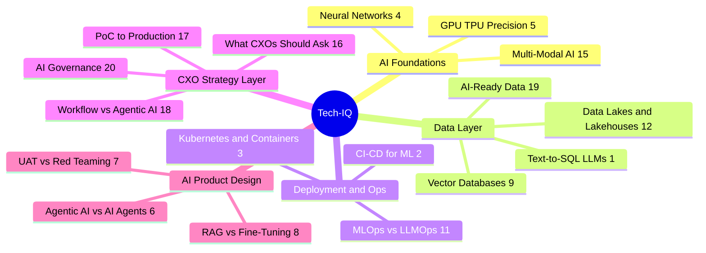

# 🧠 Tech-IQ: From Bytes to Boardrooms
*Curated Tech Wisdom for Strategic Leaders*

Welcome to **Tech-IQ** — a no-jargon, executive-savvy series designed to decode complex AI/ML technologies and infrastructure for business leaders, architects, and modern decision-makers. Each edition is a standalone capsule of clarity — explaining not just how the tech works, but what it means for decisions, investments, and risk.

---

## 🔍 Tech-IQ Series

### 🧙‍♂️ [Tech IQ #1: LLMs Aren't Magic Wands!](https://github.com/itsual/Tech-IQ/tree/main/Text-2-SQL-LLM-ISNT-MAGIC)
📂 `Text-2-SQL-LLM-ISNT-MAGIC`
🧠 Text-to-SQL with LLMs demands schema awareness, guardrails, and validation — not just a prompt.
🔧 LLMs are autocomplete machines, not certified SQL analysts.

---

### 🚀 [Tech IQ #2: CI/CD for ML — It's Not Just "Pushing Buttons"](https://github.com/itsual/Tech-IQ/tree/main/CI-CD)
📂 `CI-CD`
🧠 CI/CD in ML includes retraining triggers, dataset versioning, evaluation thresholds — not just Git commits.
🔧 ML pipelines look like DevOps with data and statistical checkpoints woven in.

---

### 🛠️ [Tech IQ #3: Kubernetes, Containers & the Hidden Plumbing of AI](https://github.com/itsual/Tech-IQ/tree/main/Kubernetes%20Containers%20%26%20More)
📂 `Kubernetes Containers & More`
🧠 Kubernetes is the invisible backbone that scales AI, ensures resilience, and manages workloads.
🔧 No YAML, no scale. Your model may be 99% accurate but 100% offline without orchestration.

---

### 🧬 [Tech IQ #4: How Neural Networks Work — From Neurons to Transformers](https://github.com/itsual/Tech-IQ/tree/main/Neural%20Network)
📂 `Neural Network`
🧠 Neural networks function as sophisticated algebraic graph flows, not biological brains.
🔧 The secret lies in how information is weighted and passed — from perceptrons to transformers.

---

### ⚙️ [Tech IQ #5: AI Compute & Precision — A Leader's Infrastructure Guide](https://github.com/itsual/Tech-IQ/tree/main/GPU%20TPU%20Precision%20etc)
📂 `GPU TPU Precision etc`
🧠 Precision (FP32 vs INT8) and hardware (GPU vs TPU) impact cost, speed, and model behavior.
🔧 Align model goals with compute constraints — don't overbuy horsepower.

---

### 🤖 [Tech IQ #6: Agentic AI ≠ AI Agents](https://github.com/itsual/Tech-IQ/tree/main/AI%20Agents%20Vs%20Agentic%20AI)
📂 `AI Agents Vs Agentic AI`
🧠 An "agent" calls APIs. An agentic AI sets goals, reasons, and adapts. Huge difference.
🔧 Agentic AI combines memory, planning, context awareness — it's orchestration, not automation.

---

### 🛡️ [Tech IQ #7: Red Teaming vs Closed UAT — LLMs Need Both](https://github.com/itsual/Tech-IQ/tree/main/UAT%20vs%20Red%20Teaming)
📂 `UAT vs Red Teaming`
🧠 Closed UAT validates use-case readiness. Red Teaming finds vulnerabilities — prompt injections, jailbreaks, adversarial QA.
🔧 UAT = "does it work?" / Red Team = "how can it break?"

---

### 🔀 [Tech IQ #8: RAG vs. Fine-Tuning — When to Customize Your LLM](https://github.com/itsual/Tech-IQ/tree/main/RAG%20vs%20Fine-Tuning)
📂 `RAG vs Fine-Tuning`
🧠 RAG solves a retrieval problem. Fine-Tuning solves a behavior problem. Confusing them wastes months and millions.
🔧 Most enterprise AI problems start as RAG problems. Upgrade to fine-tuning only when you have a proven behavioral gap.

---

### 🗄️ [Tech IQ #9: Vector Databases — The Memory Layer of AI](https://github.com/itsual/Tech-IQ/tree/main/Vector%20Databases)
📂 `Vector Databases`
🧠 Traditional databases find rows by ID. Vector databases find meaning by geometry.
🔧 Embeddings encode semantics as numbers. Vector DBs search them at millisecond speed across millions of documents.

---

### ⚗️ [Tech IQ #11: MLOps vs. LLMOps — Why Deploying LLMs Is a Different Beast](https://github.com/itsual/Tech-IQ/tree/main/MLOps%20vs%20LLMOps)
📂 `MLOps vs LLMOps`
🧠 In MLOps, the model is the artifact. In LLMOps, the prompt is the artifact. Everything downstream changes.
🔧 Prompt versioning, LLM-as-judge evaluation, guardrails, and token cost monitoring are new disciplines.

---

### 🏗️ [Tech IQ #12: Data Lakes, Warehouses & Lakehouses — Picking the Right Architecture](https://github.com/itsual/Tech-IQ/tree/main/Data%20Lakes%20Warehouses%20and%20Lakehouses)
📂 `Data Lakes Warehouses and Lakehouses`
🧠 Warehouses are for SQL. Lakes are for cost. Lakehouses give you both — the foundation of every modern AI strategy.
🔧 The Medallion Architecture (Bronze → Silver → Gold) turns data chaos into business-ready intelligence.

---

### 👁️ [Tech IQ #15: Multi-Modal AI — When Your Model Can See, Hear, and Read](https://github.com/itsual/Tech-IQ/tree/main/Multi-Modal%20AI)
📂 `Multi-Modal AI`
🧠 Multi-modal AI processes text, images, audio, and video simultaneously — unlocking automation of every information type.
🔧 GPT-4o, Gemini, and Claude now read invoices, interpret factory photos, transcribe meetings, and reason across all of them in one session.

---

### 🔍 [Tech IQ #16: What CXOs Should Really Ask Before Approving an LLM Project](https://github.com/itsual/Tech-IQ/tree/main/What%20CXOs%20Should%20Ask%20Before%20Approving%20an%20LLM%20Project)
📂 `What CXOs Should Ask Before Approving an LLM Project`
🧠 The questions your AI vendor hopes you never raise — across business case, data readiness, failure modes, TCO, and vendor lock-in.
🔧 A five-domain interrogation framework and a 10-question printable scorecard for every AI approval decision.

---

### 💥 [Tech IQ #17: Why Your AI PoC Succeeded and Your Production Deployment Failed](https://github.com/itsual/Tech-IQ/tree/main/Why%20Your%20AI%20PoC%20Succeeded%20and%20Production%20Deployment%20Failed)
📂 `Why Your AI PoC Succeeded and Production Deployment Failed`
🧠 The PoC used clean data, expert users, and a controlled scope. Production exposed everything else.
🔧 Seven killers — data gap, evaluation gap, integration gap, scale gap, adoption gap, governance gap, expectation gap — and how to close each.

---

### ⚙️ [Tech IQ #18: Workflow Automation vs. Agentic AI — Stop Calling Everything "Agentic"](https://github.com/itsual/Tech-IQ/tree/main/Workflow%20Automation%20vs%20Agentic%20AI)
📂 `Workflow Automation vs Agentic AI`
🧠 If your RPA bot moves data between columns, that is not Agentic AI. If your chatbot follows a script, that is not Agentic AI.
🔧 A five-level automation spectrum, a four-question diagnostic, and a vendor mislabeling cheat sheet for every pitch.

---

### 📊 [Tech IQ #19: What Does "AI-Ready Data" Actually Mean?](https://github.com/itsual/Tech-IQ/tree/main/What%20Does%20AI-Ready%20Data%20Actually%20Mean)
📂 `What Does AI-Ready Data Actually Mean`
🧠 The model is the last 20% of the problem. The data is the first 80%. AI-ready data has six non-negotiable dimensions.
🔧 A practitioner's audit framework — completeness, consistency, accuracy, timeliness, representativeness, lineage — with applied SQL checks and a readiness scorecard.

---

### ⚖️ [Tech IQ #20: AI Governance — What the Board Should Own vs. Delegate](https://github.com/itsual/Tech-IQ/tree/main/AI%20Governance%20-%20What%20the%20Board%20Should%20Own%20vs%20Delegate)
📂 `AI Governance - What the Board Should Own vs Delegate`
🧠 Accountability doesn't disappear because a model made the decision. Directors carry personal liability in some jurisdictions for AI-caused harm.
🔧 A three-layer governance stack, EU AI Act risk classification simplified, and a board-level checklist covering risk appetite, accountability, ethics boundaries, and incident response.

---

## 📈 How the AI & ML Ecosystem Connects

```mermaid
flowchart LR
    Dev[Data Science Team] -->|Build Models| Model[ML Models]
    Model -->|Package & Test| Deploy[Deployment Pipeline]
    Deploy -->|Automate Release| Cloud[Cloud Infrastructure]
    Cloud -->|Serve Securely| Business[Business Applications]
    Business -->|Generate Insights| Value[Business Value]

    subgraph Governance [Governance & Operations]
        G1[Model Versioning]
        G2[Security & Compliance]
        G3[Cost Management]
        G4[Performance Monitoring]
    end

    subgraph Outcomes [Business Outcomes]
        O1[Faster Time to Market]
        O2[Scalable Operations]
        O3[Increased Efficiency]
        O4[Competitive Advantage]
    end

    Value -->|Continuous Improvement| Dev
    Governance --- Dev
    Governance --- Model
    Governance --- Deploy
    Governance --- Cloud
    Governance --- Business
    Value --> Outcomes

    classDef primary fill:#4285F4,stroke:#333,color:white;
    classDef governance fill:#FBBC05,stroke:#333,color:black;
    classDef outcomes fill:#EA4335,stroke:#333,color:white;
    class Dev,Model,Deploy,Cloud,Business,Value primary;
    class Governance,G1,G2,G3,G4 governance;
    class Outcomes,O1,O2,O3,O4 outcomes;
```

---

## 🗺️ Tech-IQ Knowledge Map

```mermaid
mindmap
  root((Tech-IQ))
    AI Foundations
      Neural Networks 4
      GPU TPU Precision 5
      Multi-Modal AI 15
    Data Layer
      Vector Databases 9
      Data Lakes and Lakehouses 12
      AI-Ready Data 19
      Text-to-SQL LLMs 1
    Deployment and Ops
      CI-CD for ML 2
      Kubernetes and Containers 3
      MLOps vs LLMOps 11
    CXO Strategy Layer
      What CXOs Should Ask 16
      PoC to Production 17
      Workflow vs Agentic AI 18
      AI Governance 20
    AI Product Design
      RAG vs Fine-Tuning 8
      Agentic AI vs AI Agents 6
      UAT vs Red Teaming 7
```

---

Simplifying tech for decisive leadership. Connect with me on [LinkedIn](https://www.linkedin.com/in/arockialiborious/) for real-talk AI insights.
