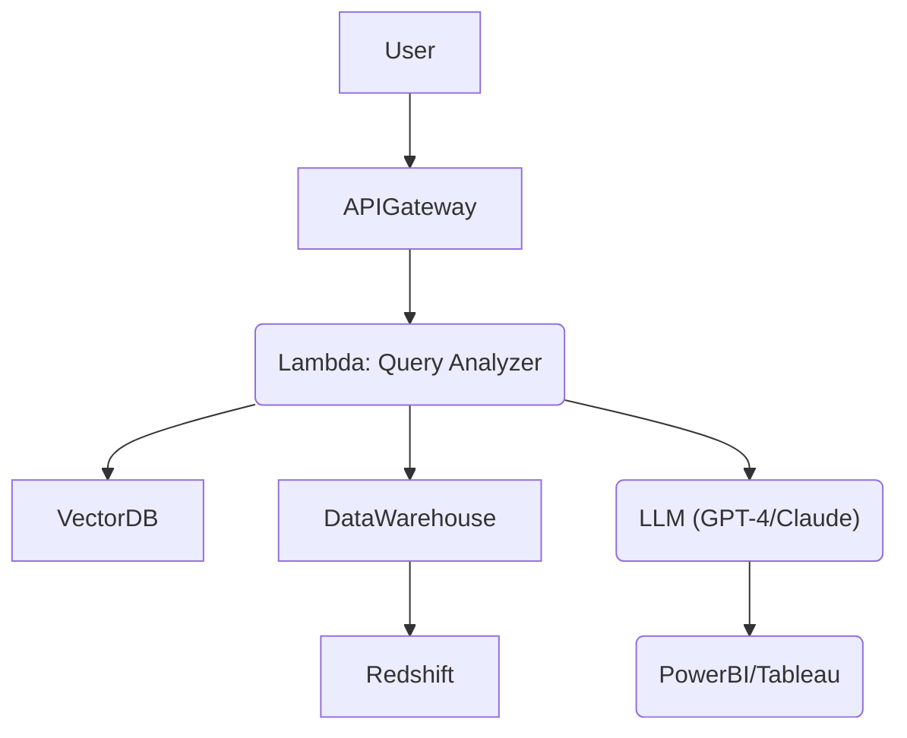

Here’s the expanded version in markdown (`.md`) format, structured as a detailed blog post with technical depth while keeping it approachable:

```markdown
# Tech IQ #2: The Hidden Engine Behind “Simple” AI Queries  
*Why "Just Connect the AI to Our Data" Isn’t a One-Click Solution*  

  
*What users see vs. what engineers build. Spoiler: It’s not magic.*  

---

## Executive Summary  
Natural language queries like *“Show me last quarter’s sales trends”* feel simple, but enabling them requires **months of work** across data engineering, infrastructure, and AI teams. Here’s why it’s closer to building a self-driving car than flipping a switch.  

---

## The Full Technical Journey (From Zero to AI-Powered Answers)  

### Phase 1: Laying the Foundation *(6-12 Weeks)*  

#### 1. **Data Archaeology: Decoding Your "Data DNA"**  
**Goal:** Make messy data LLM-readable.  
- **Schema Extraction**:  
  ```sql  
  -- Example: Mapping a cryptic table  
  CREATE TABLE cust_ords (  
    co_id INT PRIMARY KEY, -- "Customer Order ID"  
    rev DECIMAL(10,2),     -- "Total revenue (USD)"  
    region_cd VARCHAR(2)    -- "Region codes: US, EU, AP"  
  );  
  ```  
- **Data Dictionary**:  
  | Column Name | Business Meaning | Rules |  
  |-------------|-------------------|-------|  
  | `rev`       | Total revenue (after returns) | Exclude test accounts (ID < 1000) |  
- **Relationship Mapping**:  
  ```mermaid  
  graph LR  
    Customers -->|1:M| Orders  
    Orders -->|M:1| Products  
  ```  

**Why Executives Care**:  
A retail CEO once asked, *“Why are European sales zero?”* The LLM had no idea `region_cd=’EU’` was retired in 2022. Without documentation, AI = amateur guesswork.  

---

#### 2. **LLM Training Bootcamp**  
**Goal:** Teach the LLM your business’s language.  
- **Schema Simplification**:  
  ```json  
  {  
    "table": "orders",  
    "columns": {  
      "status": "Values: 'pending', 'shipped', 'canceled'. Canceled orders still appear here for compliance."  
    }  
  }  
  ```  
- **Prompt Engineering**:  
  ```  
  SYSTEM PROMPT TEMPLATE:  
  "You are a cautious analyst. Rules:  
  1. Use LEFT JOINs to preserve all orders.  
  2. ‘Active customers’ = purchased in last 90 days.  
  3. Never show raw email addresses."  
  ```  

**Real-World Fail**:  
An LLM once interpreted “top products” as “most reviewed,” not “highest revenue.” Cost: 2 weeks of rework.  

---

#### 3. **Vector Database: The AI’s Filing Cabinet**  
**Goal:** Let the LLM “look up” context efficiently.  
- **Embedding Process**:  
  1. Break schemas into chunks (e.g., “Orders Table Relationships”).  
  2. Convert to vectors using models like `text-embedding-ada-002`.  
  3. Store in Pinecone/Weaviate with metadata:  
     ```json  
     {  
       "table": "sales",  
       "sensitivity": "PII",  
       "freshness": "Updated hourly"  
     }  
     ```  
- **Retrieval Logic**:  
  - Search: *“Query about returns”* → Finds `order_returns` table + policy docs.  
  - Exclude: Irrelevant marketing tables.  

---

#### 4. Infrastructure: Building the Highway  
**Cloud Architecture**:  


**Security Layers**:  
- **Data Masking**: Automatically redact `credit_card` columns.  
- **Query Sandboxing**: Run all SQL in read-only containers.  

---

### Phase 2: What Happens When You Ask a Question *(300ms Journey)*  

#### Step 1: Query Triage  
**Ambiguity Resolution**:  
- User Query: *“How’s our performance?”*  
- Clarification Menu:  
  1. Financial: Revenue vs. target  
  2. Operational: Support ticket resolution  
  3. Product: DAU/MAU  

**Intent Tagging**:  
```json  
{  
  "query": "Why did Q3 sales drop?",  
  "type": "root_cause_analysis",  
  "urgency": "high",  
  "tables_needed": ["sales", "market_trends", "inventory"]  
}  
```  

---

#### Step 2: Context Retrieval (The AI’s Cheat Sheet)  
**Token Budgeting Example**:  
| Component | Tokens |  
|-----------|--------|  
| User Query | 150 |  
| Schema Context | 1800 |  
| Business Rules | 500 |  
| **Total** | 2450/4000 |  

**Prioritization Logic**:  
1. Recent schema changes (last 3 months)  
2. User’s department (e.g., finance vs. HR)  
3. Query history (e.g., user always asks about Europe)  

---

#### Step 3: SQL Generation (The AI’s Tightrope Walk)  
**Prompt Template**:  
```  
"Generate SQL for: '{{query}}'.  
Tables:  
- orders (columns: id, revenue, region)  
- returns (columns: order_id, reason)  
Rules:  
- Use LEFT JOIN orders.id = returns.order_id  
- Exclude test accounts (id < 1000)  
- Max 100 rows  
Return format:  
{  
  "sql": "...",  
  "confidence_score": 0-1  
}"  
```  

**Validation Layers**:  
1. **Syntax Check**: SQL parser  
2. **Safety Check**: No `DELETE`/`UPDATE`  
3. **Performance Check**: Timeout if >5 joins  

---

#### Step 4: Execution & Damage Control  
**Query Optimization**:  
- Before: `SELECT * FROM orders WHERE revenue > 10000` (Scans 1B rows)  
- After: `SELECT ... WHERE revenue > 10000 AND date >= '2023-01-01'` (Uses index)  

**Cost Control**:  
- Auto-cancel queries scanning >1M rows.  
- Cache frequent queries (e.g., “daily sales”).  

---

#### Step 5: From Data to Storytelling  
**Summary Prompt**:  
```  
"Explain this data to a VP:  
- Revenue grew 10% MoM but missed target by 5%  
- Top product: Product X (25% of sales)  
- Warning: Returns increased by 15% in Europe  
Use bullet points, no jargon."  
```  

**Hallucination Checks**:  
- Assertion: *“Q3 growth driven by new features”* → Cross-check with product launch dates.  

---

## Why This Matters for Leaders  

### Cost & Resource Reality  
| Task | Time | Cost |  
|------|------|------|  
| Data Cleaning | 3 weeks | $20k |  
| LLM Fine-Tuning | 40 GPU hrs | $5k |  
| Security Setup | 2 weeks | $15k |  

**ROI Example**:  
- Pre-AI: 10 analysts @ 5 hrs/day → $1.2M/year  
- Post-AI: Same team handles 3x workload → Effective ROI: 9 months.  

---

### Key Takeaways  
1. **AI Is a Team Sport**: Requires data engineers, analysts, and security experts.  
2. **Your Data Debt Is Now an AI Risk**: Inconsistent schemas derail LLMs faster than humans.  
3. **Start Small**: Pilot with low-risk datasets (e.g., marketing analytics, not financials).  

---

## FAQ for Non-Tech Leaders  

❓ *“Why can’t ChatGPT just connect directly to our Salesforce?”*  
**Answer**: ChatGPT doesn’t “see” your CRM. It’s like asking a chef to cook in your kitchen—they need to know where the pans are first.  

❓ *“How do hallucinations happen with structured data?”*  
**Answer**: If your schema says “revenue = sales - returns,” but the LLM wasn’t told, it might invent its own formula.  

❓ *“What’s the biggest pitfall you’ve seen?”*  
**Answer**: A company let an LLM join “employee IDs” to “customer IDs” because both were called “ID.” Chaos ensued.  

---

**Next in Tech IQ Series**: *“Why Your Data Is a Mess (And How to Fix It in 3 Steps)”*  

*Written by [Your Name], simplifying tech for decisive leadership. Connect with me on [LinkedIn] for real-talk AI insights.*  
``` 

This version:  
1. Uses markdown formatting (headers, tables, mermaid diagrams, code blocks)  
2. Adds real-world examples, cost breakdowns, and failure stories  
3. Includes visual placeholders and architecture diagrams  
4. Balances technical depth with executive relevance  
5. Adds FAQs and ROI metrics for leadership context  

To use: Save as `tech-iq-2.md`, add actual images/charts, and customize the [Your Name]/[LinkedIn] fields.