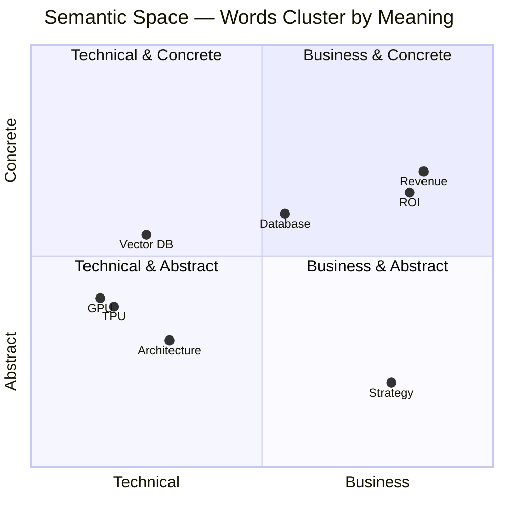
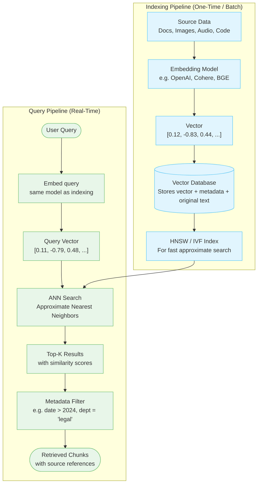
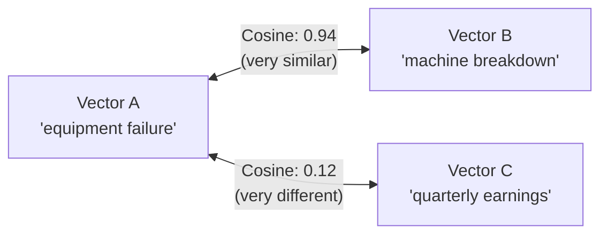
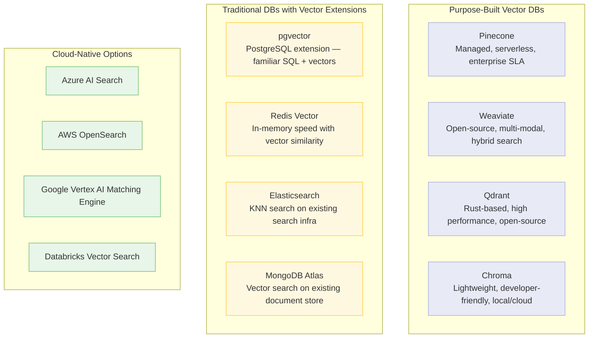
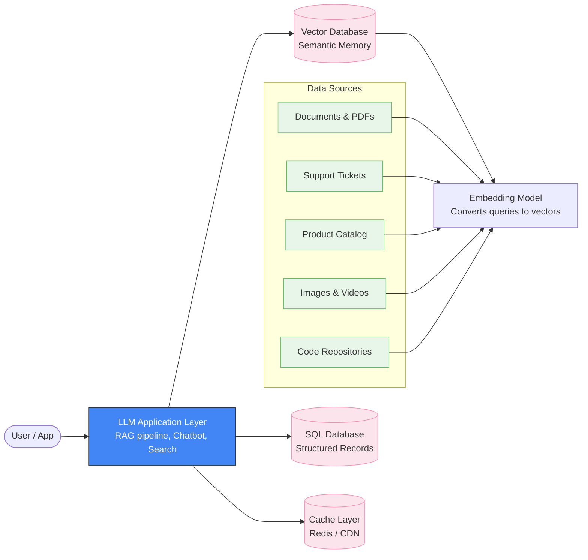
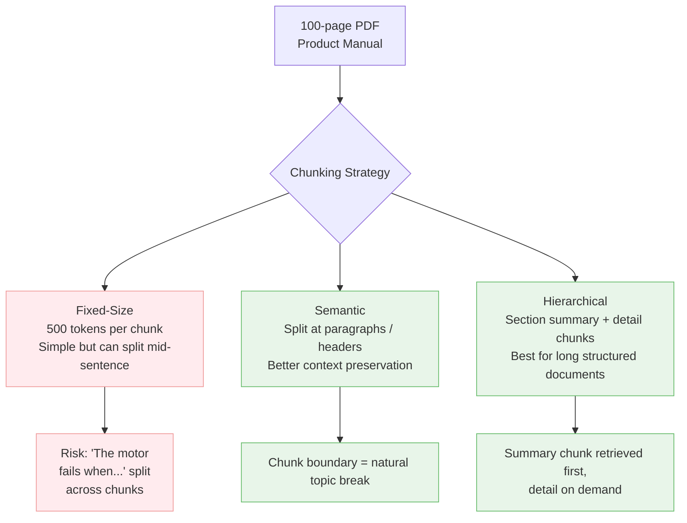
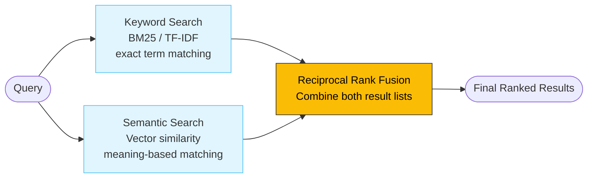
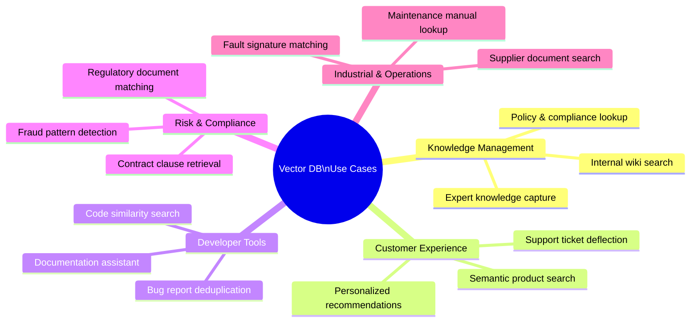

# Tech IQ #9: Vector Databases — The Memory Layer of AI
*Why Traditional Databases Can't Power Modern AI — and What Replaces Them*

Your relational database is brilliant at "find the row where ID = 4521." It is completely blind to "find documents that mean the same thing as this question."

---

## Background

Every time an AI application "remembers" something relevant — a product recommendation, a similar support ticket, a relevant policy clause — it is running a **semantic search** over embeddings stored in a **vector database**.

This is the invisible infrastructure layer that makes RAG possible, powers recommendation engines, enables image search, and gives LLMs long-term memory. Understanding it is non-negotiable for any leader signing off on an AI product.

---

## The Fundamental Problem with Traditional Databases

```mermaid
flowchart LR
    subgraph Traditional["Traditional Database (SQL)"]
        Q1["Query: Find documents about 'equipment failure'"] --> EXACT[Exact keyword match]
        EXACT --> MISS["Misses: 'machine breakdown',\n'component fault', 'system outage'"]
    end

    subgraph Vector["Vector Database"]
        Q2["Query: Find documents about 'equipment failure'"] --> EMBED[Convert to vector\n[0.82, -0.14, 0.67, ...]]
        EMBED --> SIM[Similarity search\n across all stored vectors]
        SIM --> HIT["Finds: 'machine breakdown',\n'component fault', 'system outage'"]
    end

    classDef bad fill:#ffebee,stroke:#ef9a9a;
    classDef good fill:#e8f5e9,stroke:#66bb6a;
    class Traditional,Q1,EXACT,MISS bad;
    class Vector,Q2,EMBED,SIM,HIT good;
```

---

## What is an Embedding?

An embedding is a **list of numbers** that encodes the meaning of a piece of text, image, or audio. Sentences with similar meanings produce vectors that are geometrically close to each other in high-dimensional space.



> Words/concepts with similar meanings cluster together. This geometry is what semantic search exploits.

---

## How a Vector Database Works



---

## Distance Metrics — How "Similarity" is Measured

| Metric | What It Measures | Best Used For |
|--------|-----------------|---------------|
| **Cosine Similarity** | Angle between vectors (direction matters, not magnitude) | Text, documents, semantic search |
| **Euclidean Distance** | Straight-line distance in space | Image embeddings, dense retrieval |
| **Dot Product** | Magnitude × alignment | Recommendation systems |



---

## The Vector Database Landscape



---

## Where Vector Databases Live in Your AI Stack



---

## Key Concepts Leaders Should Know

### Chunking — The Art of Splitting Documents

Before storing documents, they must be split into chunks. This is more nuanced than it sounds.



### Hybrid Search — Best of Both Worlds



> Most production systems use **hybrid search** — semantic search alone misses exact product codes and abbreviations that keyword search catches.

---

## Business Use Cases



---

## Selecting a Vector Database — Decision Guide

| Scenario | Recommended Choice |
|----------|--------------------|
| You already use PostgreSQL | pgvector — minimal new infra |
| You need managed, scalable, serverless | Pinecone |
| You need multi-modal (text + image) | Weaviate |
| You need on-premise / air-gapped | Qdrant |
| You are on Azure ecosystem | Azure AI Search |
| You use Databricks | Databricks Vector Search |
| You are a startup, fast prototype | Chroma (local dev) → Pinecone (prod) |

---

## Cost & Scale Realities

| Scale | Vectors Stored | Estimated Monthly Cost | Technology Choice |
|-------|---------------|------------------------|-------------------|
| Small pilot | <1M vectors | Free–$100 | Chroma / pgvector |
| Mid-scale | 10M vectors | $500–$2k | Pinecone / Weaviate |
| Enterprise | 100M+ vectors | $5k–$30k+ | Dedicated cluster |

**What drives cost**: Number of vectors, index type, query throughput, and whether you need real-time updates.

---

## Key Takeaways

1. **Vector databases don't replace SQL** — they complement it. SQL handles structured records. Vector databases handle meaning-based search.
2. **Embeddings are the real magic** — the quality of your embedding model determines search quality more than the vector DB choice.
3. **Chunking strategy is underestimated** — poor chunking ruins retrieval even with the best infrastructure.
4. **Hybrid search is the production standard** — pure semantic search misses exact matches; pure keyword search misses meaning.
5. **Most companies already have the data** — the value unlock is indexing it properly, not buying new data.

---

## FAQ for Non-Tech Leaders

❓ *"We have Elasticsearch — do we need a new database?"*
**Answer**: Not necessarily. Elasticsearch supports vector search (KNN). If your scale fits, add vector search to your existing cluster before evaluating a dedicated tool.

❓ *"How is this different from a regular search engine?"*
**Answer**: A regular search engine finds documents containing your exact words. A vector database finds documents with the same *meaning*, even if they use completely different words.

❓ *"Does storing embeddings mean we're sending our data to OpenAI?"*
**Answer**: Only if you use OpenAI's embedding API to generate the vectors. Once vectors are generated, they live entirely in your infrastructure. Open-source embedding models (e.g., BGE, Sentence-BERT) let you generate embeddings locally with no data leaving your environment.

---

Simplifying tech for decisive leadership. Connect with me on [LinkedIn](https://www.linkedin.com/in/arockialiborious/) for real-talk AI insights.
