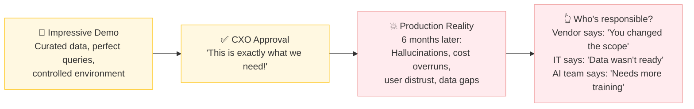
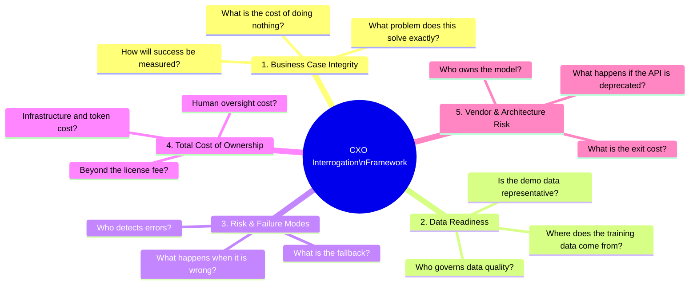
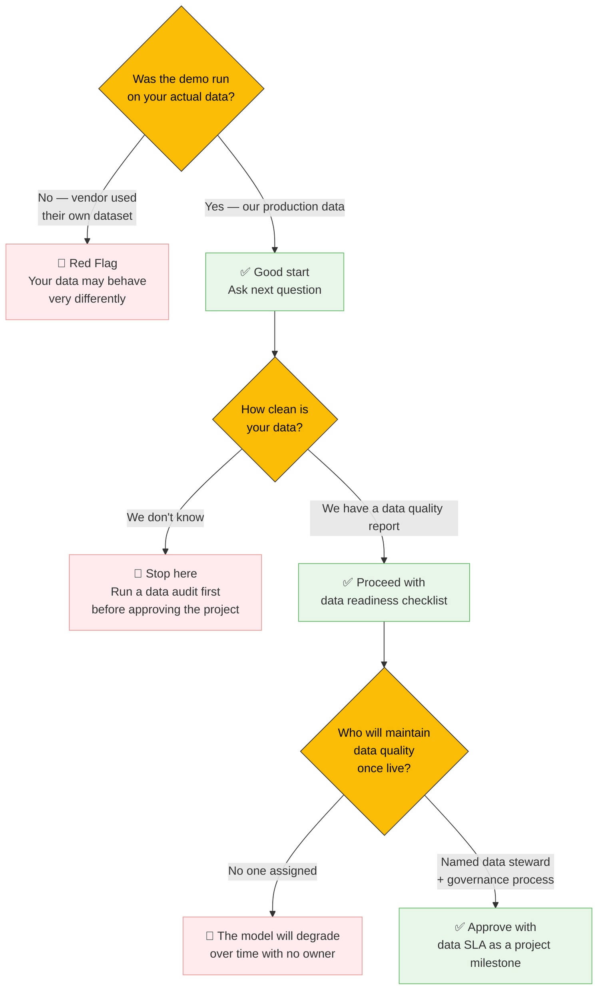
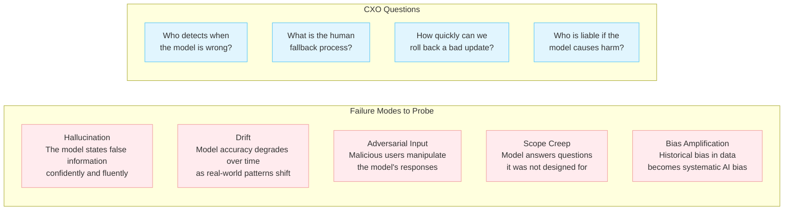
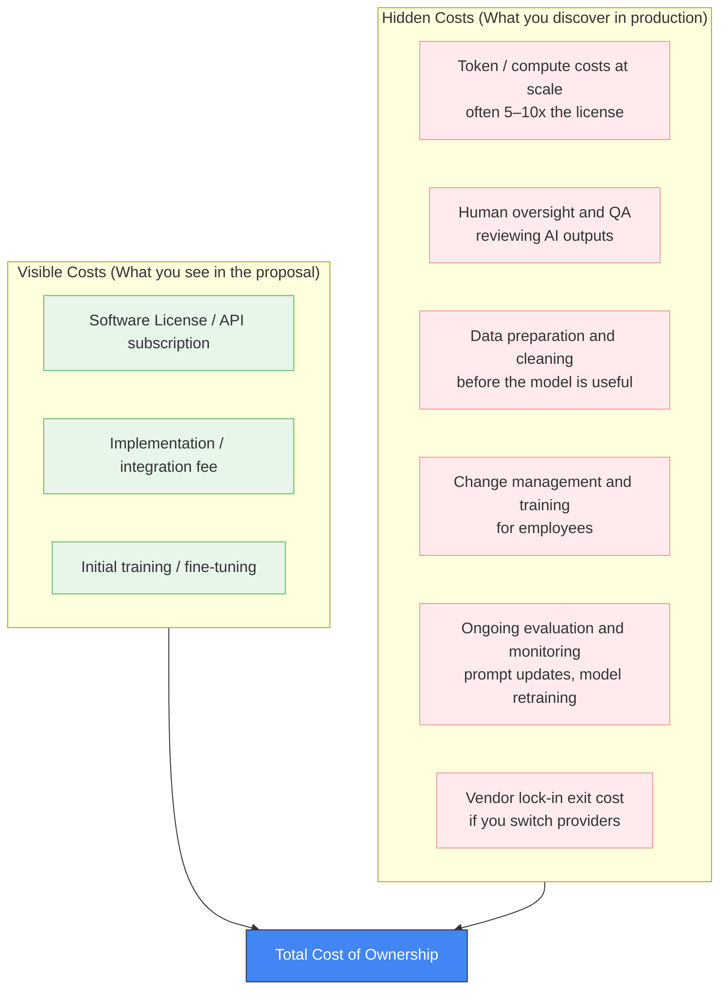
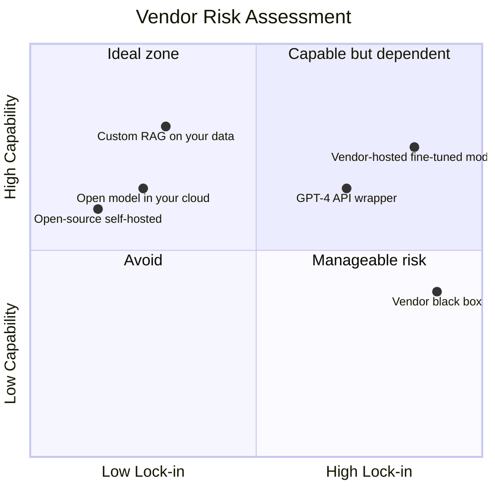
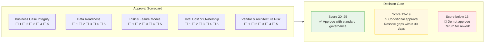

# Tech IQ #16: What CXOs Should Really Ask Before Approving an LLM Project
*The Questions Your AI Vendor Hopes You Never Raise*

Every AI vendor pitch ends with a demo that works perfectly. The question is whether it will work on your data, your users, your processes — and what it will actually cost when it does.

This edition is a CXO interrogation guide. Not to block AI adoption — but to ensure you are approving a real business investment, not a proof-of-concept dressed up in production clothes.

---

## The Approval Trap

The approval trap is not a failure of technology. It's a failure of the questions asked before approval.

---

## The Five Domains of CXO Interrogation

---

## Domain 1: Business Case Integrity

These questions filter out "AI for AI's sake" proposals before a single dollar is committed.

| Question to Ask | What a Weak Answer Sounds Like | What a Strong Answer Sounds Like |
|-----------------|-------------------------------|----------------------------------|
| What specific business outcome does this improve? | "It will make us AI-driven" | "It reduces invoice processing time from 4 days to 4 hours, affecting 3,000 invoices/month" |
| How will we measure success in 90 days? | "We'll track user satisfaction" | "We will measure: error rate below 2%, processing time under 10 min, and cost per invoice below ₹15" |
| What is the baseline we are improving against? | "The current process is manual and slow" | "Current process costs ₹42/invoice with 6% error rate. Target: ₹15/invoice with <2% error rate" |
| What is the cost of doing nothing? | "We'll fall behind competitors" | "Competitor X automated this in 2024. Our ops cost differential is now ₹2.4Cr/year and growing" |
| Who is the business owner — not the tech owner? | Silence or "the AI team owns it" | Named business leader with P&L accountability |

---

## Domain 2: Data Readiness

**The single most common reason AI projects fail is not the model — it is the data.**

### The Data Readiness Checklist to Demand

| Check | Question |
|-------|----------|
| **Representativeness** | Does the training/demo data reflect the full range of real-world inputs — including edge cases and exceptions? |
| **Recency** | How old is the data? Will the model know about policy changes from last quarter? |
| **Labeling quality** | If supervised learning is involved, who labeled the data and how was inter-rater agreement validated? |
| **Coverage** | Does the data include rare but critical scenarios — regulatory edge cases, minority language queries, low-volume but high-value transactions? |
| **PII & compliance** | Has sensitive data been masked, anonymized, or consented for AI training use? |
| **Lineage** | Can you trace where each data point came from and how it was transformed? |

---

## Domain 3: Risk & Failure Modes

Most AI approvals focus entirely on the upside. Responsible approval requires equal attention to failure modes.

### The Three Failure Questions No Vendor Wants

**1. "Show me the last time this model was wrong — and what happened."**
A vendor with no answer has no production experience. A vendor with a good answer has learned from it.

**2. "What is the human escalation path when the model fails?"**
Every AI system needs a human-in-the-loop for high-stakes decisions. If there is no defined escalation, you do not have a production system — you have a demo.

**3. "What is the contract liability if the model causes a compliance violation?"**
Most AI vendor contracts shift liability entirely to the customer. Know this before you sign.

---

## Domain 4: Total Cost of Ownership

The license fee is the smallest number in the TCO. Here is the full picture.

### The TCO Reality Check

| Cost Category | Typical % of 3-Year TCO | Questions to Ask |
|---------------|------------------------|------------------|
| License / API fee | 15–25% | Is pricing per seat, per token, or per call? What happens at 10x volume? |
| Infrastructure (compute, storage) | 20–30% | Who pays for GPU/API costs as usage scales? |
| Data preparation | 15–25% | Is your data clean enough to start, or is this a hidden pre-project? |
| Human oversight | 10–20% | How many FTEs are needed to review, correct, and escalate AI outputs? |
| Change management | 5–10% | What does adoption actually require — training, workflow redesign, role changes? |
| Ongoing maintenance | 10–15% | Who owns prompt updates, model retraining, and evaluation as the business changes? |

---

## Domain 5: Vendor & Architecture Risk

### Vendor Lock-in Questions

| Question | Why It Matters |
|----------|----------------|
| Can we export our data and prompts if we switch vendors? | Some vendors hold your fine-tuned model hostage |
| What happens to our project if the underlying model API is deprecated? | OpenAI deprecated GPT-3.5 Turbo — all apps broke overnight |
| Is the architecture portable to another cloud or model provider? | Abstraction layers (LiteLLM, LangChain) protect you; hard-coded API calls do not |
| Who owns the fine-tuned model weights? | Read the contract — some vendors retain ownership of models trained on your data |
| What is the SLA for model availability and what are the penalties? | "Best effort" uptime is not an enterprise SLA |

---

## The CXO Approval Scorecard

Rate each domain 1–5 before signing off:

---

## The 10 Questions — Printable Version

1. What specific, measurable business outcome does this improve — and by how much?
2. Who is the named business owner (not tech owner) of this initiative?
3. Was the demo run on our actual production data? If not, why not?
4. What is our data quality score and who governs it ongoing?
5. What happens when the model is wrong — who detects it and what is the fallback?
6. What is the full 3-year TCO including compute, human oversight, and change management?
7. What are we locked into — and what is the cost and process to exit?
8. Who owns the model weights if we fine-tune on our data?
9. What is the vendor's liability if the model causes a compliance violation?
10. How will we measure success in 90 days — with a number, not a sentiment?

---

## Key Takeaways

1. **The demo is not the product.** Demos use curated data and controlled queries. Insist on a pilot on your messy, real production data before approval.
2. **Data readiness is not an IT problem — it's a business prerequisite.** No AI project should be approved without a data quality audit signed off by the business.
3. **TCO is 3–5x the license fee.** Compute, human oversight, and change management are the real costs. Model the full 3-year picture before signing.
4. **Failure mode planning is not pessimism — it is governance.** Every approved AI system needs a human escalation path and a rollback plan.
5. **Vendor lock-in is a strategic risk.** Open table formats, model portability, and data export rights should be in every AI contract.

---

Simplifying tech for decisive leadership. Connect with me on [LinkedIn](https://www.linkedin.com/in/arockialiborious/) for real-talk AI insights.
