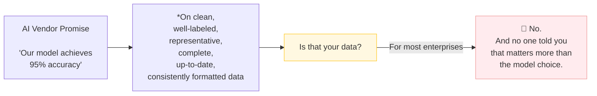
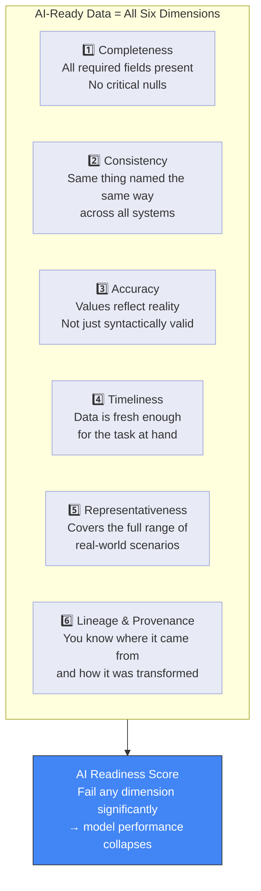
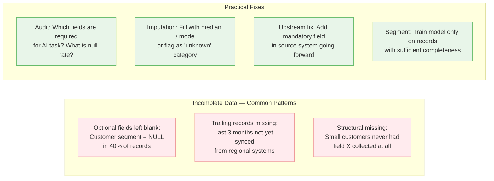
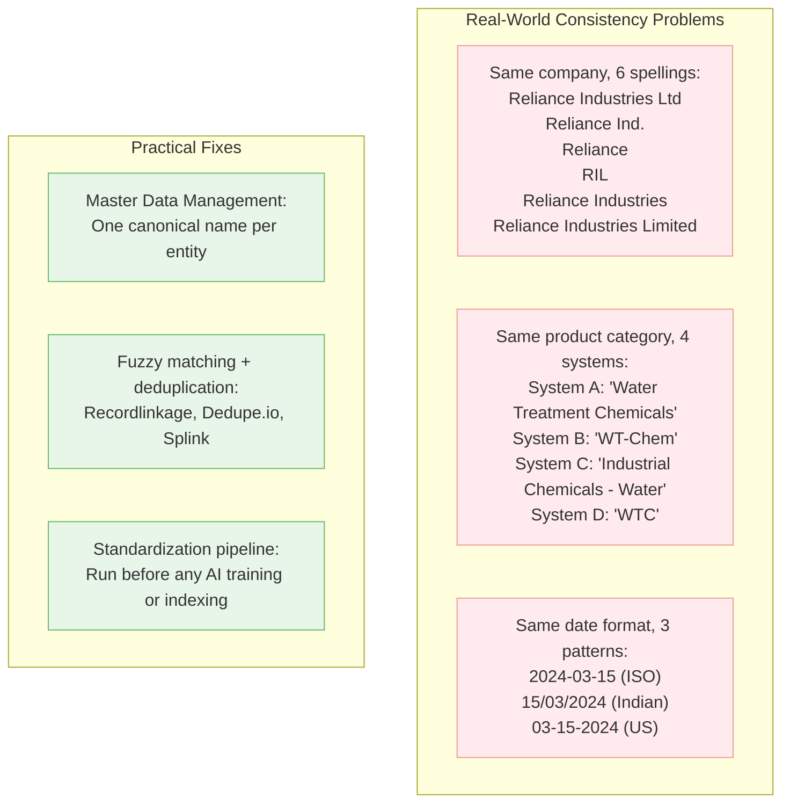
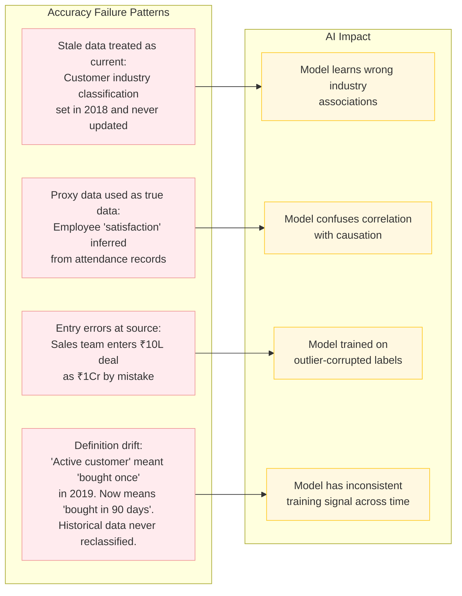
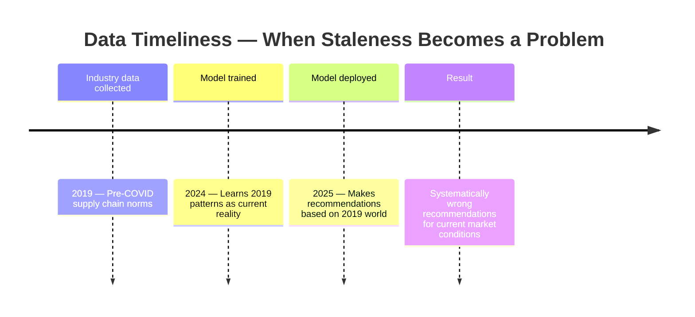
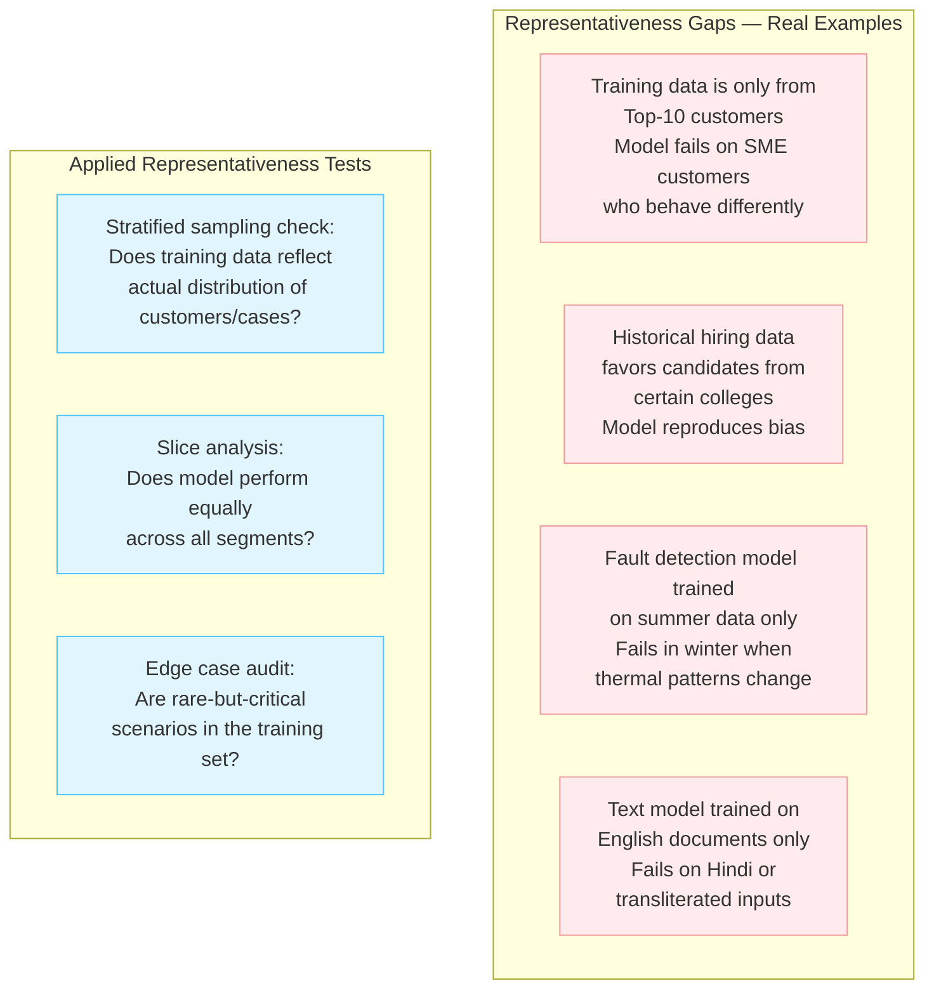
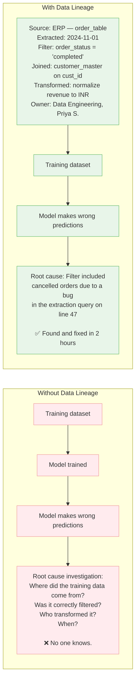
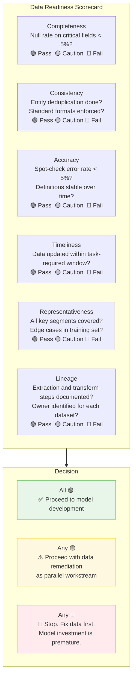

# Tech IQ #19: What Does "AI-Ready Data" Actually Mean?
*The Foundation Every AI Project Assumes You Have — and Almost Nobody Does*

Every AI vendor assumes your data is ready. Every AI project plan assumes your data is ready. The most common reason AI projects fail — including PoCs that never reach production — is that the data was never ready to begin with.

This edition is a practitioner's guide to diagnosing and building AI-ready data — no theory, all applied.

---

## The Hard Truth



The model is the last 20% of the problem. The data is the first 80%. AI-ready data is not a nice-to-have — it is the prerequisite that determines whether any model can work on your problem.

---

## The Six Dimensions of AI-Ready Data



---

## Dimension 1: Completeness

A model cannot learn from what is not there. Missing data is not just a gap — it is often a pattern that introduces bias.



**Applied Check**: For your AI task, list the 5 most critical fields. Run this query on your database:
```sql
SELECT
  field_name,
  COUNT(*) AS total_records,
  SUM(CASE WHEN field_value IS NULL OR field_value = '' THEN 1 ELSE 0 END) AS null_count,
  ROUND(100.0 * SUM(CASE WHEN field_value IS NULL OR field_value = '' THEN 1 ELSE 0 END) / COUNT(*), 1) AS null_pct
FROM your_table
GROUP BY field_name;
```
If null_pct > 10% on a critical field, you have a completeness problem before you have an AI problem.

---

## Dimension 2: Consistency

Inconsistency is the silent killer. The same real-world entity described in 12 different ways produces 12 different embedding vectors — and the model treats them as 12 different things.



**Applied Check**: Pick one critical entity type (customer name, product name, location). Export all unique values. If you see >3 representations of the same real-world entity, you have a consistency problem.

---

## Dimension 3: Accuracy

Data that is complete and consistent can still be wrong. Accuracy means the data reflects ground truth.



**Applied Check**: Sample 50 random records. Have a domain expert manually verify each one against ground truth. If >5% are factually wrong, your accuracy problem will corrupt the model.

---

## Dimension 4: Timeliness

AI models learn patterns from historical data. If that history is stale, the model learns yesterday's world.



| Use Case | Minimum Data Freshness Required | Consequence of Stale Data |
|----------|--------------------------------|--------------------------|
| Customer churn prediction | Last 90 days of behavior | Recommends retention offer to already-churned customer |
| Demand forecasting | Last 12 months including recent seasonality | Misses new demand patterns |
| Fraud detection | Last 30 days (fraud patterns evolve fast) | Misses new fraud signatures entirely |
| NLP on internal policies | Updated within 30 days of policy changes | Answers based on superseded rules |
| Equipment fault diagnosis | Historical + last 6 months of sensor data | Baseline drift ignored |

**Applied Check**: For every dataset going into your AI system, document: when was this last updated? How often does ground truth change? If update frequency < change frequency, you have a timeliness problem.

---

## Dimension 5: Representativeness

A model trained on biased samples produces biased predictions — not because the model is flawed, but because the data only showed it part of the world.



**Applied Check**: Run your model on each major segment separately (by region, product line, customer size, time period). If accuracy varies by more than 10 percentage points across segments, representativeness is the root cause.

---

## Dimension 6: Lineage & Provenance

You cannot trust a model you cannot trace. Lineage is the audit trail of your data — where it came from, what transformed it, and whether those transformations are valid.



**Tools for lineage**: Apache Atlas, OpenLineage, dbt (built-in lineage), Azure Purview, Collibra, Databricks Unity Catalog.

---

## The AI Data Readiness Audit — Practical Scorecard

Run this before any AI project is approved:



---

## What AI-Ready Data Looks Like End-to-End

```mermaid
flowchart LR
    subgraph Source["Source Systems"]
        ERP[ERP\nOrder & invoice data]
        CRM[CRM\nCustomer interactions]
        IoT[Sensors / IoT\nEquipment readings]
        Docs[Documents\nContracts, manuals, reports]
    end

    subgraph Pipeline["AI Data Pipeline"]
        Ingest[Ingest with schema validation\nreject malformed records at entry]
        Profile[Data Profiling\nnull rates, distributions, outliers]
        Clean[Cleaning & Standardization\ndeduplication, formatting, imputation]
        Enrich[Enrichment\nexternal data, calculated features]
        Label[Labeling\nhuman-reviewed ground truth\nfor supervised tasks]
        Version[Dataset Versioning\nimmutable snapshots, lineage logged]
    end

    subgraph Governance["Governance Layer"]
        Catalog[Data Catalog\nwhat exists, where, who owns it]
        Quality[Quality Monitoring\nalerts when quality degrades]
        Access[Access Control\nPII masked, role-based access]
    end

    subgraph AI["AI Layer"]
        Train[Model Training]
        Eval[Evaluation on held-out set]
        Deploy[Production Deployment]
    end

    Source --> Pipeline
    Pipeline --> AI
    Governance --> Pipeline
    Governance --> AI

    classDef source fill:#e8eaf6,stroke:#9fa8da;
    classDef pipe fill:#e1f5fe,stroke:#4fc3f7;
    classDef gov fill:#fff8e1,stroke:#ffca28;
    classDef ai fill:#e8f5e9,stroke:#66bb6a;

    class ERP,CRM,IoT,Docs source;
    class Ingest,Profile,Clean,Enrich,Label,Version pipe;
    class Catalog,Quality,Access gov;
    class Train,Eval,Deploy ai;
```



---

## The Cost of Getting This Wrong vs. Right

| Approach | Timeline | Cost | AI Outcome |
|----------|----------|------|------------|
| Skip data readiness, build model immediately | Model ready in 4 weeks | Low upfront | 60–70% accuracy, fails in production, 6+ months of firefighting |
| Build data pipeline first, then model | Model ready in 12–16 weeks | Medium upfront | 85–92% accuracy, stable in production, incremental improvement possible |
| Data readiness + governance + CI for data | Model ready in 20–24 weeks | High upfront | 90–95% accuracy, self-healing pipeline, model improves as data improves |

**The counterintuitive truth**: The team that spends 8 extra weeks on data readiness ships a production-grade AI system. The team that skips it spends 6 months debugging a model that was never the problem.

---

## The Three Questions to Ask of Any Dataset Before Approving AI Investment

**1. "Can you show me the data quality report — null rates, outlier rates, and consistency checks?"**
If this does not exist, create it before approving anything. Budget for a 2–4 week data profiling sprint as the first milestone.

**2. "Is this data a representative sample of the real-world distribution the model will face in production?"**
Demand stratified coverage analysis — by time period, geography, customer segment, product line, or whatever dimensions matter for your use case.

**3. "Who is the named data owner who will maintain quality after the model goes live?"**
A model without a data owner degrades silently. Data quality is not a one-time project — it is a continuous discipline.

---

## Key Takeaways

1. **AI is only as good as the data it learns from.** A state-of-the-art model on bad data outperforms a mediocre model on good data — never. The data always wins.
2. **Data readiness is a 6-dimension problem.** Completeness, consistency, accuracy, timeliness, representativeness, and lineage. Fix all six — not just the easiest one.
3. **Data profiling is the first AI deliverable, not a pre-project nicety.** Budget it, schedule it, and make it a milestone gate before model development begins.
4. **Representativeness is the most under-audited dimension.** Models that look great on average fail catastrophically on the segments that were underrepresented in training.
5. **Data governance is what keeps AI working 2 years after launch.** Without a data catalog, quality monitoring, and a named owner, every AI system degrades — it is just a matter of when.

---

Simplifying tech for decisive leadership. Connect with me on [LinkedIn](https://www.linkedin.com/in/arockialiborious/) for real-talk AI insights.
