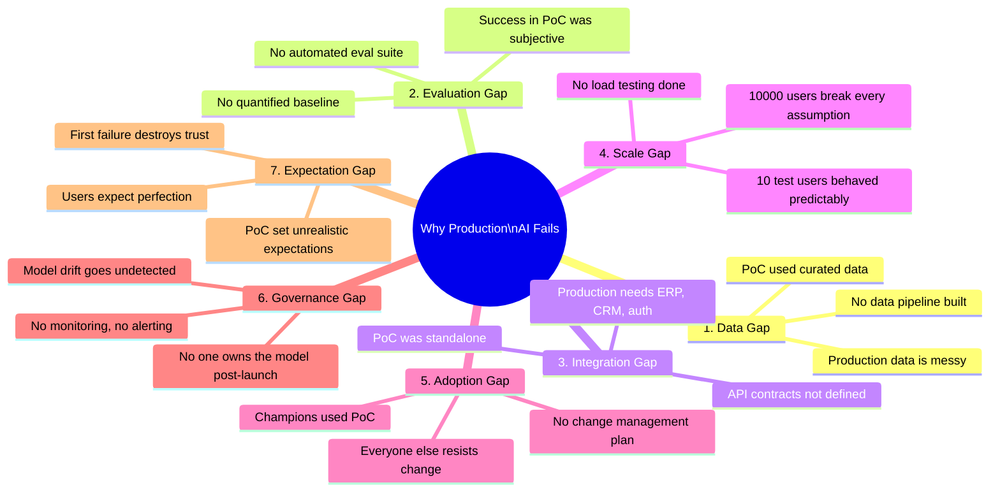
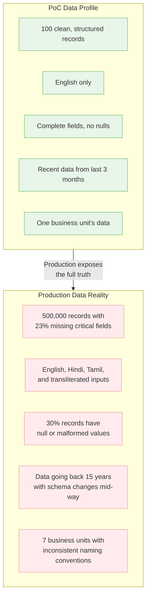
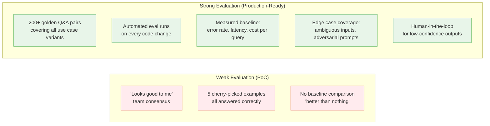
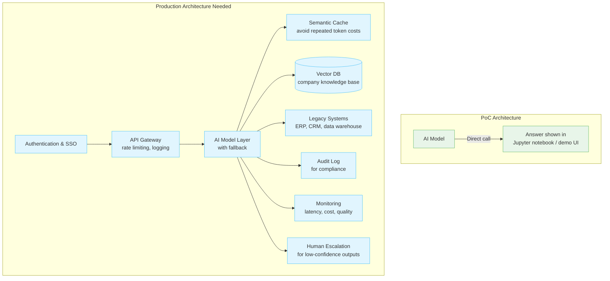
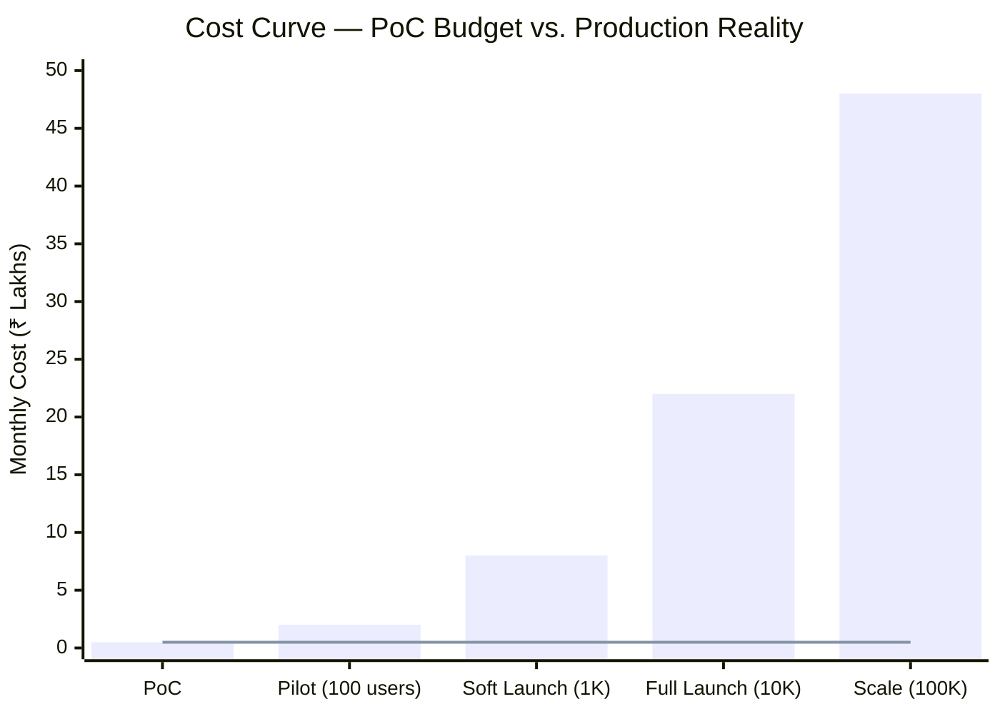
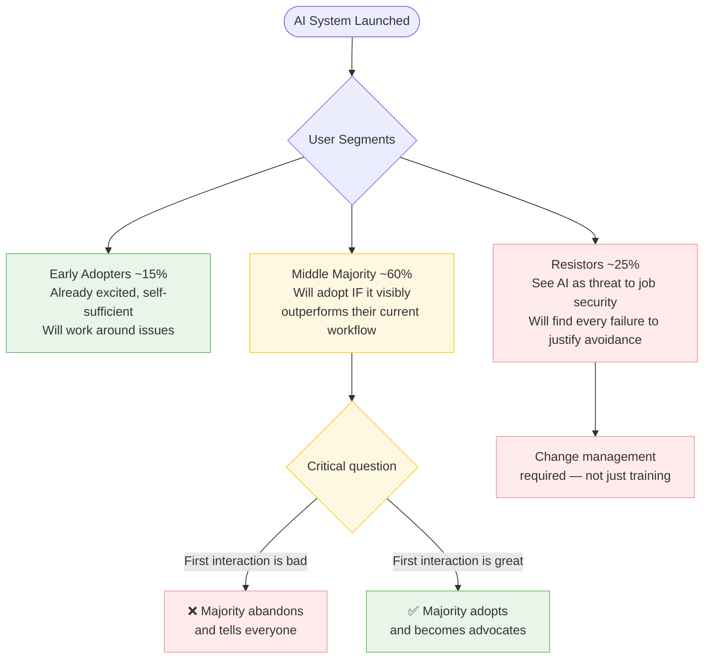
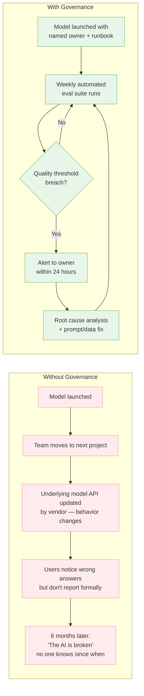
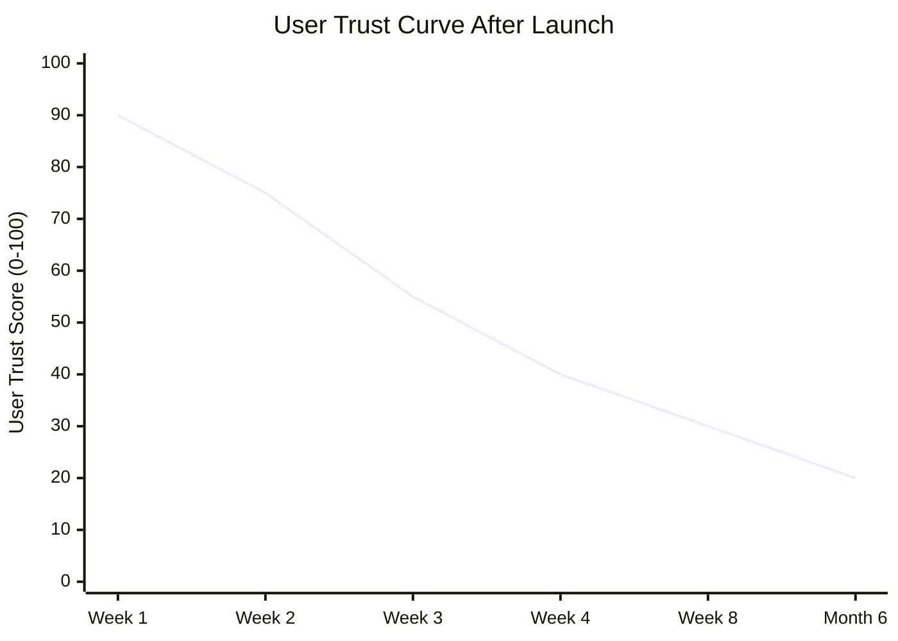

# Tech IQ #17: Why Your AI PoC Succeeded and Your Production Deployment Failed
*The Most Expensive Gap in Enterprise AI — and How to Close It*

The AI proof-of-concept worked beautifully. The demo impressed the board. The budget was approved. Six months later, the production system is limping, users don't trust it, and the team is quietly hoping no one asks for an ROI update.

This is not a rare story. It is the dominant pattern in enterprise AI adoption.

---

## The PoC-to-Production Gap

```mermaid
flowchart LR
    subgraph POC["The PoC World"]
        P1[Clean, hand-picked data]
        P2[Expert users who know\nhow to prompt correctly]
        P3[Controlled, narrow scope]
        P4[Small scale — 10 test cases]
        P5[Team excitement and\nhigh engagement]
        P6[No legacy system integration]
        P7[Best-case scenarios only]
    end

    subgraph PROD["The Production World"]
        PR1[Messy, inconsistent,\nincomplete real data]
        PR2[All users — including those\nwho don't understand AI]
        PR3[Scope creep from 12\ndifferent stakeholders]
        PR4[Scale — 10,000 queries/day]
        PR5[User frustration when\nit fails even once]
        PR6[Must integrate with\nERP, CRM, legacy APIs]
        PR7[Edge cases dominate\n80% of real traffic]
    end

    POC -->|"The Gap\n(where projects die)"| PROD

    classDef poc fill:#e8f5e9,stroke:#66bb6a;
    classDef prod fill:#ffebee,stroke:#ef9a9a;
    class P1,P2,P3,P4,P5,P6,P7 poc;
    class PR1,PR2,PR3,PR4,PR5,PR6,PR7 prod;
```

---

## The Seven Killers of AI Production Deployment

---

## Killer #1 — The Data Gap

The PoC team cherry-picked inputs that the model handles well. Production exposes everything else.

**The Fix**: Run your production data through the model *before* the PoC ends. Not after approval — before. A data compatibility report is a PoC deliverable, not a post-approval discovery.

---

## Killer #2 — The Evaluation Gap

In the PoC, "it works" meant the team thought the answers looked good. In production, there is no agreed definition of correct.

**The Rule**: If you cannot define "correct" for 200 representative queries before go-live, you are not ready for production.

---

## Killer #3 — The Integration Gap

A PoC running in isolation is not a product. It is a science project.

**The Fix**: Production architecture review must happen at PoC kickoff — not at production planning. Every system the AI must connect to should be identified in week one.

---

## Killer #4 — The Scale Gap

Scale changes everything. What works for 10 users breaks for 10,000.

| Dimension | PoC Assumption | Production Reality |
|-----------|---------------|-------------------|
| **Concurrent users** | 5 team members | 500–5,000 peak concurrent |
| **Query volume** | 50 queries/day | 50,000 queries/day |
| **Response time SLA** | "Fast enough" in demo | <2 seconds P95 SLA |
| **Token cost** | Negligible in testing | ₹15–50 lakh/year at scale |
| **Error handling** | Not tested | 503s, timeouts, rate limits hit daily |
| **Data freshness** | One-time load | Real-time or daily pipeline updates needed |

> The bar is actual cost. The flat line is what PoC teams budget for.

---

## Killer #5 — The Adoption Gap

Technology is 30% of the challenge. People are 70%.

**The Fix**: The first user experience must be engineered to succeed — narrow scope, high-confidence use cases only at launch. Expand scope only after trust is established.

---

## Killer #6 — The Governance Gap

Who owns the model after go-live? This question is almost never answered in PoC planning.

---

## Killer #7 — The Expectation Gap

PoCs accidentally set impossible standards. Users who saw the curated demo expect every query to work as well as the demo queries did.

> Trust collapses fast when reality meets PoC-inflated expectations. Recovery is expensive.

**The Fix**: Set expectations explicitly. Communicate accuracy rates, known limitations, and what the fallback is before launch — not after the first complaint.

---

## The Production Readiness Checklist

Before any AI system goes live, every row below should have a named owner and a verified answer:

| Readiness Area | Gate Criteria | Owner |
|---------------|--------------|-------|
| **Data** | Production data pipeline tested end-to-end, data quality score documented | Data Engineering Lead |
| **Evaluation** | 200+ golden test cases, automated eval suite passing at ≥target threshold | AI/ML Lead |
| **Integration** | All downstream systems connected, error handling tested, rollback plan documented | Engineering Lead |
| **Scale** | Load tested to 3x expected peak, cost model validated at full scale | Platform Lead |
| **Adoption** | Training delivered, change management plan executed, support escalation defined | Business Owner |
| **Governance** | Named model owner, monitoring dashboard live, alert thresholds set | Product/AI Owner |
| **Expectation** | User communication sent with accurate scope, limitations, and fallback documented | Change Manager |

---

## Key Takeaways

1. **The PoC should stress-test failure, not showcase success.** A PoC that only shows what works is a marketing exercise, not due diligence.
2. **Production readiness is an 8-week discipline, not a launch checklist.** Start building evaluation suites, integration architecture, and governance plans at PoC kickoff.
3. **User trust is your most fragile asset.** One bad first experience with a mid-management skeptic becomes an org-wide reputation — plan the first 30 days of go-live like a product launch.
4. **Scale economics are non-linear.** Run the cost model at 10x expected volume before signing. Token costs at enterprise scale routinely shock finance teams.
5. **Governance is not bureaucracy — it is the difference between a product and a project.** Every AI system in production needs a named owner, a monitoring plan, and a response playbook.

---

Simplifying tech for decisive leadership. Connect with me on [LinkedIn](https://www.linkedin.com/in/arockialiborious/) for real-talk AI insights.
