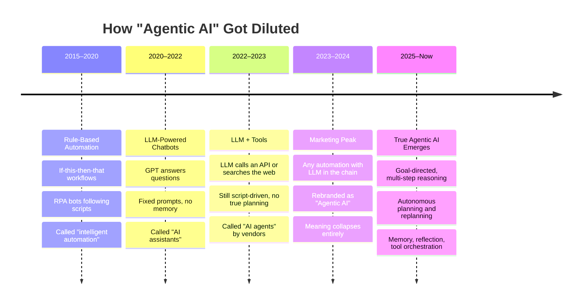
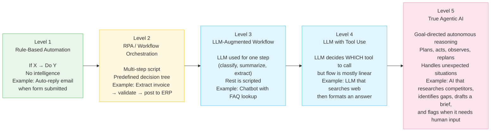
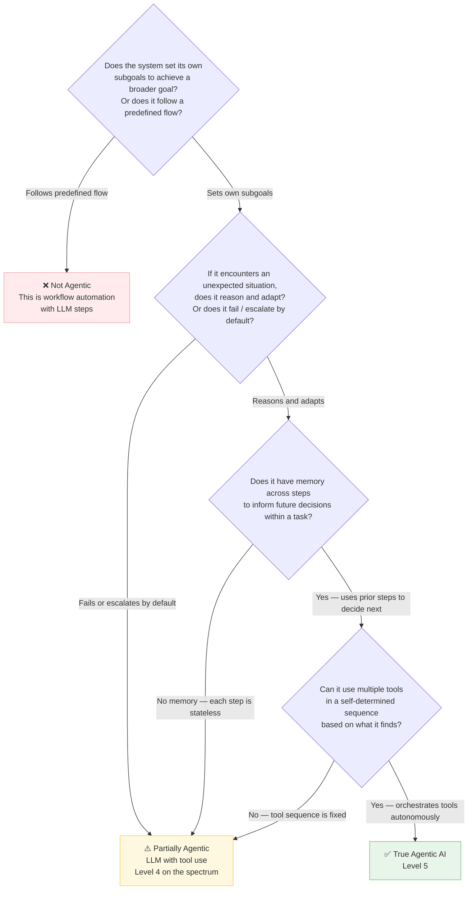
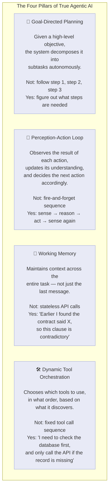
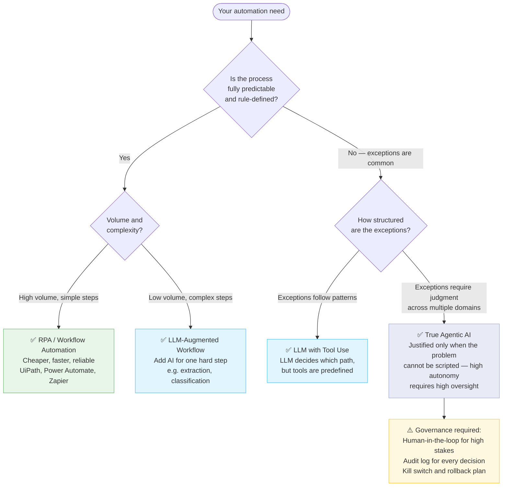
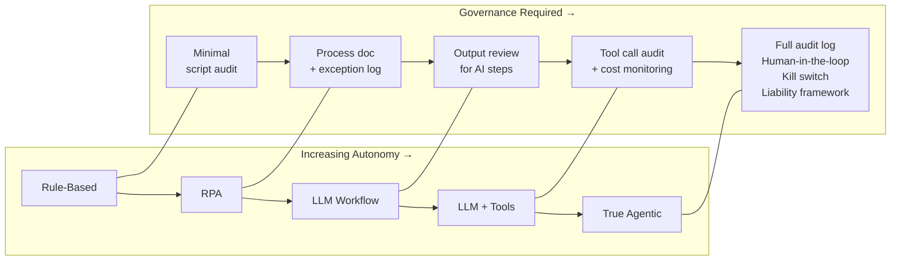

# Tech IQ #18: Workflow Automation vs. Agentic AI — Stop Calling Everything "Agentic"
*A Field Guide to Cutting Through the Most Abused Term in Enterprise AI*

If your vendor's chatbot sends an email when a form is submitted, that is not Agentic AI. If your RPA bot moves data from one column to another, that is not Agentic AI. If an LLM follows a fixed 5-step script, that is not Agentic AI.

The word "agentic" has been stripped of meaning by people who benefit from the confusion. This edition gives you the diagnostic to call it out — and the vocabulary to demand precision.

---

## The Hype Lifecycle of "Agentic AI"

---

## The Spectrum: From Script to Agency

Not all automation is equal. Here is the full spectrum from deterministic scripts to genuinely agentic systems:

> **Levels 1–3** are workflow automation. **Level 4** is emerging AI capability. **Level 5** is true Agentic AI. Most vendor pitches call Level 2–3 "agentic."

---

## The Diagnostic: Is It Really Agentic?

Ask these four questions. A "No" on any of the first three means it is not agentic — no matter what the sales deck says.

---

## Side-by-Side: The Same Use Case at Each Level

**Use Case: Handling a customer complaint email**

| Level | What Happens | What It's Called |
|-------|-------------|-----------------|
| **L1 — Rule-Based** | Email tagged "complaint" → auto-reply sent → ticket created in CRM | Email automation / workflow |
| **L2 — RPA** | Email parsed → sentiment detected via keyword → routed to correct team queue → SLA timer started | Intelligent automation / RPA |
| **L3 — LLM Workflow** | LLM reads email and classifies sentiment + urgency → routes to team → generates draft reply for agent | AI-assisted support / copilot |
| **L4 — LLM + Tools** | LLM reads email → searches CRM for customer history → checks order status API → drafts personalized reply with resolution options | AI agent (borderline) |
| **L5 — True Agentic** | LLM reads email → identifies complaint type → retrieves customer history and contract terms → determines if refund is warranted per policy → drafts response → if ambiguous, formulates a clarifying question → flags cases exceeding authority threshold for human review — all without a predefined script | Agentic AI |

---

## What Real Agentic AI Looks Like

True agentic AI has four defining properties — all four must be present:

---

## The Vendor Mislabeling Cheat Sheet

Use this when a vendor calls something "agentic" in a pitch:

| Vendor Claim | What to Ask | Likely Reality |
|-------------|-------------|----------------|
| "Our agentic AI handles end-to-end workflows" | "Can it handle a workflow that goes outside the predefined steps?" | RPA with LLM wrapper |
| "Our agent remembers context across conversations" | "Does it remember across separate sessions or just within one conversation?" | In-session context window, not true memory |
| "Our AI autonomously takes action on your behalf" | "Show me a case where it encountered an unexpected situation and adapted its plan" | Scripted automation with LLM for one step |
| "Our multi-agent system coordinates AI workers" | "How does Agent A communicate a discovery to Agent B and change B's plan?" | Parallel LLM calls, not true multi-agent coordination |
| "It learns from every interaction" | "Does the model actually retrain, or is this RAG retrieval of past sessions?" | Session logging fed back into context, not learning |

---

## When to Use What

---

## The Governance Implication

True agentic systems are **more capable** and **more dangerous** than scripted automation. The more autonomous the system, the more governance it requires — not less.

> **The leadership mistake**: Approving agentic AI because it sounds advanced, while applying the same governance you'd use for a simple workflow script.

---

## Key Takeaways

1. **"Agentic" has a definition — demand it is used correctly.** Goal-directed planning, perception-action loop, working memory, and dynamic tool orchestration. All four. Not one.
2. **Most "AI agents" in vendor pitches are Level 2–3 automation.** That is still valuable — but price it, govern it, and expect it accordingly.
3. **Scripted automation is often the right answer.** Do not buy a Level 5 system for a Level 2 problem. Complexity has costs.
4. **True agentic AI requires true governance.** Autonomous systems that take actions in the real world need audit logs, kill switches, and human oversight loops — by design, not as an afterthought.
5. **Ask the demo question**: "Show me a case where the system encountered something outside its training and tell me what it did." The answer tells you everything about where on the spectrum you actually are.

---

Simplifying tech for decisive leadership. Connect with me on [LinkedIn](https://www.linkedin.com/in/arockialiborious/) for real-talk AI insights.
